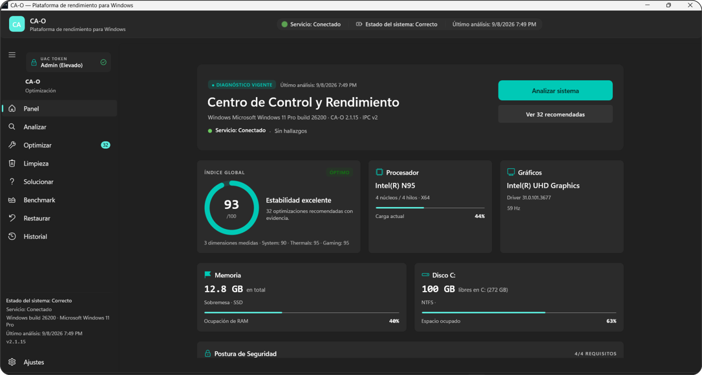
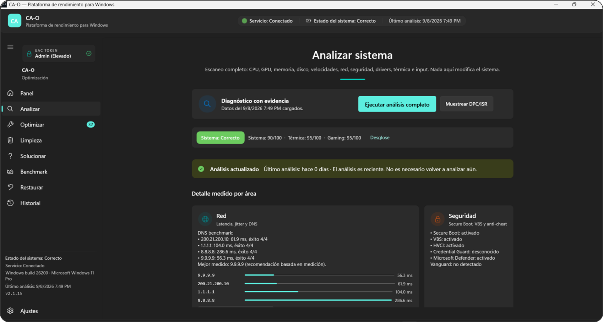
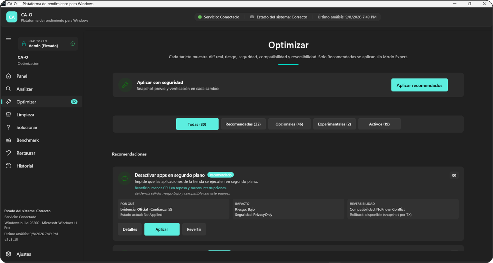
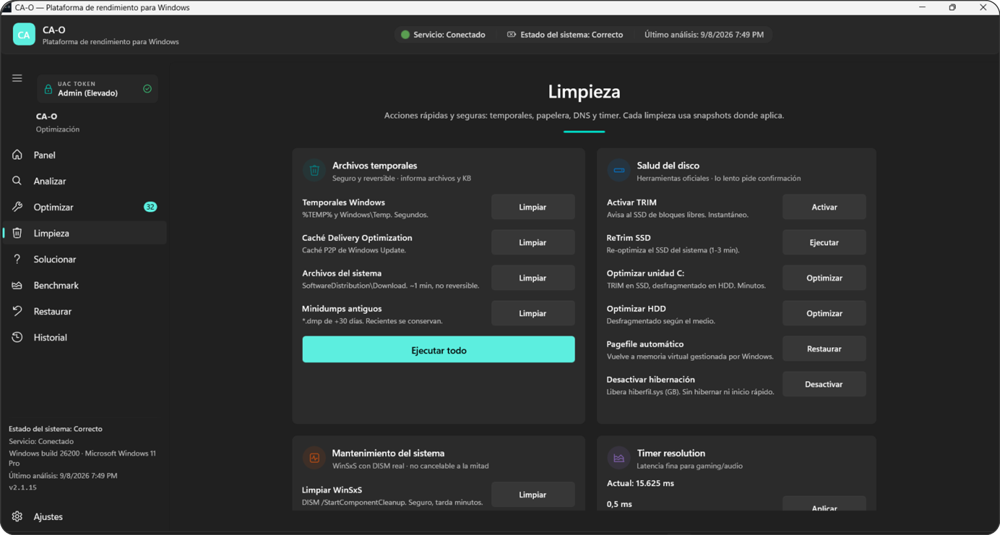
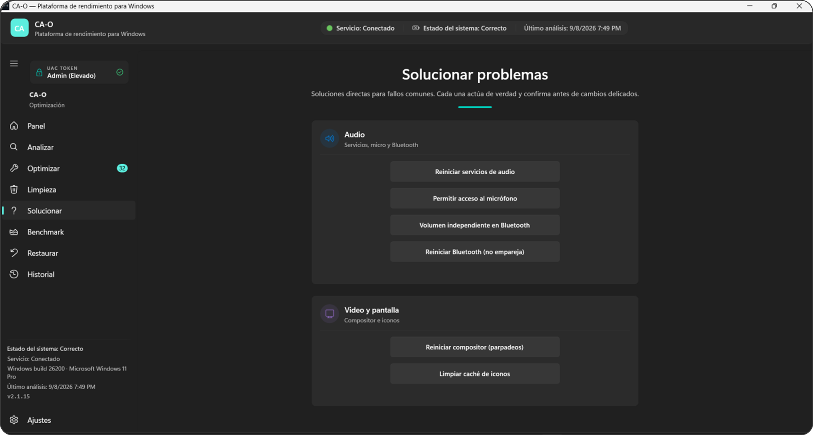
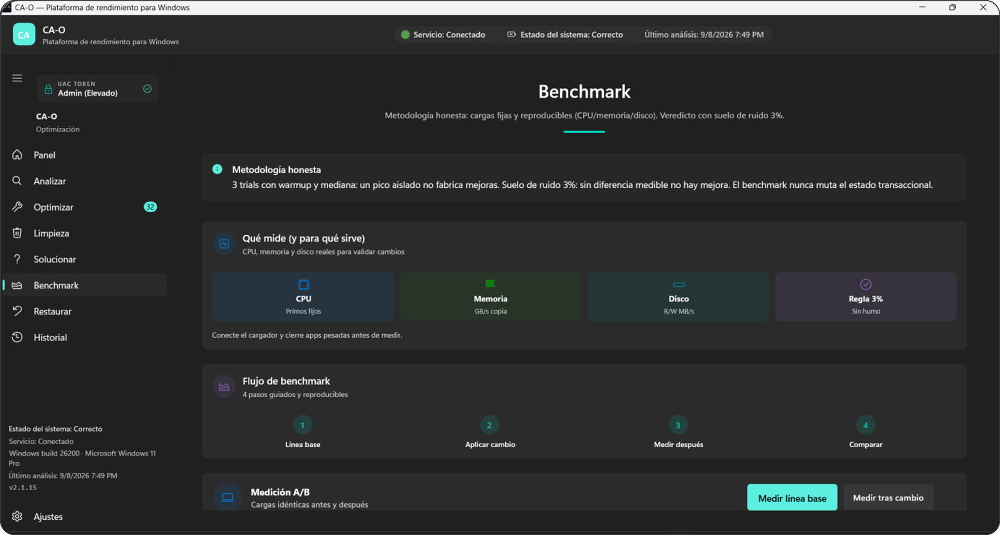
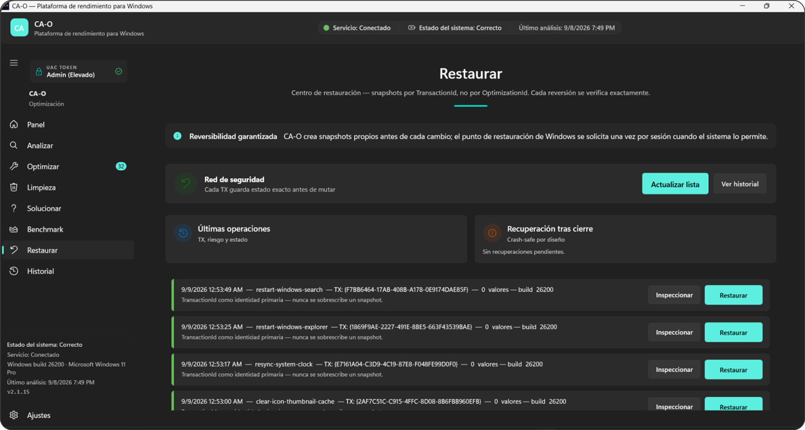
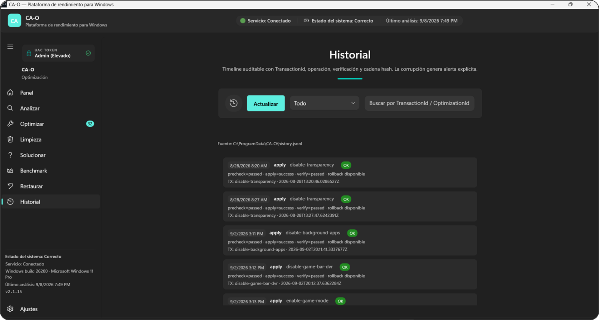
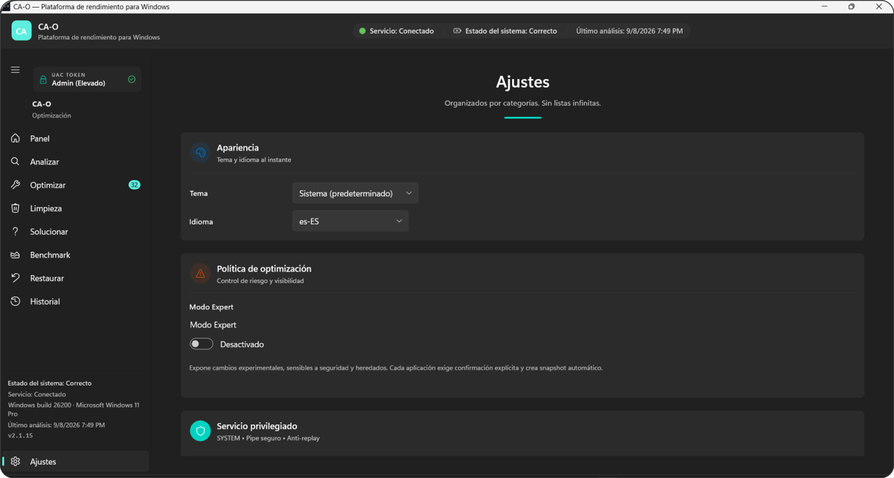

# CA-O 2.1.35 — Plataforma nativa de rendimiento, diagnóstico y optimización para Windows 11

> **Principio operativo:** diagnosticar primero → recomendar con evidencia → aplicar en transacción → verificar → revertir si falla. Sin promesas numéricas falsas, solo hechos medibles.

[](https://www.microsoft.com/windows)
[](global.json)
[](https://microsoft.github.io/microsoft-ui-xaml/)
[](https://github.com/Pyromesis/CA-O/actions)
[](#-pruebas)
[](https://github.com/Pyromesis/CA-O/releases/tag/v2.1.35)
[](#licencia)

**Descargas v2.1.35:** [CA-O.Setup.exe (135 MB, descargador de un solo exe: baja el paquete y abre el instalador)](https://github.com/Pyromesis/CA-O/releases/download/v2.1.35/CA-O.Setup.exe) | [CA-O-Setup-GUI-x64.zip (88 MB, paquete completo offline)](https://github.com/Pyromesis/CA-O/releases/download/v2.1.35/CA-O-Setup-GUI-x64.zip) | [CA-O-Setup-GUI-x64.exe (instalador con asistente Inno Setup)](https://github.com/Pyromesis/CA-O/releases/download/v2.1.35/CA-O-Setup-GUI-x64.exe) | [SHA256SUMS.txt](https://github.com/Pyromesis/CA-O/releases/download/v2.1.35/SHA256SUMS.txt) | [Notas de la versión](https://github.com/Pyromesis/CA-O/releases/tag/v2.1.35) | [Documentación](docs/ARCHITECTURE.md)

---

## Índice

1. [Resumen ejecutivo](#resumen-ejecutivo)
2. [Filosofía y pilares](#filosofía-y-pilares)
3. [Stack tecnológico](#stack-tecnológico)
4. [Arquitectura profunda](#arquitectura-profunda)
5. [Estructura del repositorio](#estructura-del-repositorio)
6. [Modelo de seguridad](#modelo-de-seguridad)
7. [Catálogo completo de optimizaciones (91)](#catálogo-completo-de-optimizaciones-91)
8. [Cómo funciona la app — viaje del usuario](#cómo-funciona-la-app--viaje-del-usuario)
9. [Motores internos](#motores-internos)
10. [Persistencia y rutas de datos](#persistencia-y-rutas-de-datos)
11. [Perfiles de optimización](#perfiles-de-optimización)
12. [Interfaz y páginas](#interfaz-y-páginas)
13. [Requisitos](#requisitos)
14. [Instalación](#instalación)
15. [Desarrollo](#desarrollo)
16. [Pruebas](#pruebas)
17. [Release y verificación](#release-y-verificación)
18. [Solución de problemas](#solución-de-problemas)
19. [Reportar un error](#reportar-un-error)
20. [Documentación](#documentación)
21. [Contribuir](#contribuir)
22. [Licencia](#licencia)

---

## Resumen ejecutivo

**CA-O 2.1.35** es una aplicación **100% nativa Windows** escrita en **.NET 10 + WinUI 3 (Windows App SDK 2.4)**. No es una colección de tweaks: **mide** hardware, térmicas, red, almacenamiento, drivers y postura de seguridad **antes** de recomendar. Cada cambio pertenece a un **bucket analizado-primero** (`Recommended` / `Optional` / `Experimental` / `SecuritySensitive` / `NotApplicable` / `Blocked`) y se ejecuta bajo el flujo transaccional `PRECHECK → SNAPSHOT → APPLY → VERIFY → COMMIT` con **rollback automático y verificación post-reversión**.

La UI **siempre eleva** (`app.manifest` `requireAdministrator` → UAC en cada inicio) pero **toda mutación privilegiada cruza** al servicio Windows `CAO.Privileged` (SYSTEM) vía **Named Pipe autenticado** con ACL restrictiva, validación de esquema tipado, ventana de 30 s, nonce y protección anti-replay. Sin el servicio, la app opera en **modo solo lectura** (diagnóstico + benchmark disponibles). El servicio es `start= demand` por diseño: tras un reinicio queda detenido y la propia app lo levanta (`sc start`) al comprobar, o lo re-registra con `Ajustes → Instalar ahora` sin necesitar el repositorio.

**En números:**
- **91 optimizaciones** con efecto real verificado (transaccionales) + `AllLegacy` para trazabilidad
- **12 páginas** WinUI 3 con Mica, `NavigationView`, animaciones de entrada, i18n `es-ES`/`en-US` instantáneo
- **1103 tests** en 6 suites (Core 643, Security 238, Integration 49, Infra 55, Benchmark 17, UI 101)
- **0 telemetría externa**, 0 dependencias web, 0 comandos arbitrarios

---

## Filosofía y pilares

| Pilar | Qué significa | Cómo se materializa |
|---|---|---|
| **DIAGNOSE** | No se recomienda sin medir | `SystemAnalysisService` ejecuta proveedores WMI/Registry en paralelo con timeout 5 s. Si un dato no está disponible → "no disponible", nunca inventado |
| **OPTIMIZE** | Solo lo medido genera recomendación | `RecommendationEngine` clasifica exactamente 1 bucket por optimización consultando `SystemContext` real |
| **BENCHMARK** | Sin promesas falsas | Flujo 5 pasos con mediana de trials, suelo de ruido 3 %, veredictos `Mejora medible` / `Sin mejora` / `Regresión`. No se simulan FPS |
| **RECOVER** | Todo es reversible | Snapshot **antes** de mutar, journal `transactions/{txid}.jsonl`, hash-chain `history.jsonl` + `integrity.json` SHA-256 |

**Decisión fundacional:** *¿Cuál es la mejor configuración para ESTE Windows, ESTE hardware, ESTE driver, ESTE juego y ESTE objetivo?* — no *¿qué tweaks tiene Internet?*

---

## Stack tecnológico

| Capa | Tecnología | Versión | Por qué |
|---|---|---|---|
| **Runtime** | .NET SDK | **10.0.400** (`global.json`, `rollForward: latestFeature`) | Self-contained, AOT-friendly, `LangVersion 13` |
| **UI** | WinUI 3 / Windows App SDK | **2.4.0** | Nativo, Mica, `NavigationView`, sin MSIX obligatorio (`WindowsPackageType: None`) |
| **MVVM** | CommunityToolkit.Mvvm | **8.4.0** | `ObservableObject`, `RelayCommand`, sin boilerplate |
| **DI** | Microsoft.Extensions.DependencyInjection + Hosting | **10.0.0** | `AppHost` centraliza `UiState`, `SystemAnalysisService`, `PrivilegedPipeClient` |
| **WMI** | System.Management | **10.0.0** | Lectura hardware/termal/batería |
| **Perf** | System.Diagnostics.PerformanceCounter | **10.0.0** | `% DPC Time` / `% Interrupt Time` |
| **Servicios** | System.ServiceProcess.ServiceController | **8.0.1** | `CAO.Privileged` como `BackgroundService` |
| **Build** | `Directory.Packages.props` + `Directory.Build.props` + `Version.props` (single source `2.1.35`) | Centralizado | Un lugar para bump de versión/paquetes |
| **Tests** | xUnit 2.9.2 + Microsoft.NET.Test.Sdk 17.11.1 | — | 1103 tests en Release |
| **Seguridad** | CodeQL + `dotnet audit` + Dependabot + CycloneDX SBOM | CI | Cadena de suministro auditada |

> **Self-contained:** los artefactos de release no requieren runtime instalado. El instalador es `self-contained` sin `single-file` (requisito WinUI 3).

---

## Arquitectura profunda

### Procesos y confianza

```
┌──────────────────────┐   Named Pipe (ACL+nonce+replay)   ┌─────────────────────────┐
│  CA-O.UI (WinUI 3)   │ ────────────────────────────────► │ CA-O.Privileged         │
│  requireAdministrator│  IpcRequest v2 tipado + allowlist │ Servicio Windows        │
│  - Diagnóstico       │ ◄──────────────────────────────── │ (LocalSystem)           │
│  - Benchmark local   │  IpcResponse JSON                 │ - Registry/Services     │
│  - Recomendaciones   │                                   │ - Power/Network/BCD     │
└──────────────────────┘                                   └─────────────────────────┘
         │                                                        │
         │ AnalysisStateStore / SnapshotRepository                │ OptimizationEngine
         ▼                                                        ▼
┌──────────────────────┐                              ┌──────────────────────┐
│ SystemAnalysisService│                              │   Windows system     │
│ (WhenAll + cancel)   │                              │ Registry / SCM / WMI │
└──────────────────────┘                              └──────────────────────┘
```

- **UI siempre elevada** pero **toda escritura cruza el pipe** aun elevada → modelo de privilegio mínimo auditado
- **Servicio valida:** versión protocolo (must = 2), identidad cliente (`GetImpersonationUserName` vía `RunAsClient()`), GUID único + nonce (mín. 16 caracteres, replay), esquema `OperationParameters`, solo 9 operaciones allowlist
- **Sin HTTP**, sin ejecución de cadenas arbitrarias, sin PowerShell en el path de ejecución (solo `CommandPolicy` con rutas absolutas `%SystemRoot%\System32`)

### Capas de código

| Proyecto | Responsabilidad | Depende de |
|---|---|---|
| `CA-O.Shared` | DTOs, contratos IPC v2 (`IpcProtocol` v2, `Ping`, `GetServiceStatus`), `CaOPaths`, `ErrorCodes CAO-XXX-nnn`, `AppVersion 2.1.35`, `BuildConstants`, `Constants/IpcConstants`, `TimeoutProfile` | — |
| `CA-O.Core` | `OptimizationCatalog` (91), `OptimizationEngine` transaccional, `RecommendationEngine` + `OptimizationScoreCalculator` (0-100), `GameCompatibilityPolicy` (matriz SAFE/CAUTION/BLOCKED `CAO-GAME-001`), `HealthEngine`, `KnownIssueMatcher`, `CrashRecoveryService`, `Rollback/*` | Shared |
| `CA-O.Infrastructure` | WMI 5 s timeout + `SystemAnalysisService` + `AnalysisStateStore` (atómico, 24 h TTL) + `SnapshotRepository`/`FileSnapshotStore` (TX identity + SHA-256) + `JsonHistoryLogger` (hash-chain) + `SystemBenchmarkRunner` + `Gaming/*` + `Networking/*` + `Storage/*` + `Security/*` + `Windows/*` | Core, Shared |
| `CA-O.Privileged` | Servicio `SYSTEM` + `PrivilegedPipeService` (Named Pipe `CA-O.Privileged.v1`, ACL + `ReplayCache` 30 s, timeout 15 s/conn) + `OptimizationEngine` hosteado + `AdministratorsOnlyAuthorizer` | Core, Infrastructure, Shared |
| `CA-O.UI` | WinUI 3 Mica + ViewModels DI (`AppHost` + `UiState`, 9 ViewModels) + `Controls` (`RiskBadge`/`ScoreRing` en `RiskBadge.cs`, `Mascot`/`MascotFlipbook`, `CaoCat`) + `PrivilegedPipeClient` + `ErrorTranslator` + `Helpers/{LocalizationHelper,UiAnimations,AppUpdater}` + 12 páginas con `VisualState` y animaciones | Core, Infrastructure, Shared |
| `CA-O.InstallerGui` | Instalador gráfico **680×620**, Mica, progress, `requireAdministrator`, registro servicio + atajos | — |
| `CA-O.Setup` | Instalador consola fallback, `requireAdministrator` | — |
| `CA-O.Uninstaller` | Desinstalador + entrada ARP (`Programs and Features`), `UninstallService` | — |

### Ciclo de vida de una optimización (transaccional)

```
PRECHECK  → CheckPreconditionsAsync(SystemContext)  // build, SSD, térmico, batería, anti-cheat
COMPAT    → GameCompatibilityPolicy.Evaluate()       // BLOCKED CAO-GAME-001 si Vanguard/EAC
SNAPSHOT  → Capture() → persistido ANTES de mutar    // crash-safe, spec 122
APPLY     → ApplyAsync(context)                     // Registry API o CommandPolicy
VERIFY    → VerifyAsync() → Detect en vivo          // PendingReboot aceptado; Unknown → rollback
COMMIT    → history.jsonl + journal {txid}.jsonl    // applyResult/verification/rollbackAvailable
ROLLBACK  → RevertAsync(snapshot) automático si APPLY o VERIFY fallan → re-VERIFY
BENCHMARK → post-commit, fallo no invalida commit   // eventos separados
```

- Lote multi-optimización: aplica **secuencialmente**; al primer fallo **detiene y revierte** lo ya aplicado cuyo riesgo sea `Safe/Low` (spec 124)
- Cancelación: solo **antes** de `SNAPSHOT`/`APPLY`. Durante `APPLY` es **atómica** → `CancellationDeferred` tras `verify→commit`

### Startup en 3 fases (no bloquea UI)

1. `App.xaml.cs` → `AppHost` DI + `SettingsStore` + `AnalysisStateStore.Load()` (hidrata `UiState` si `fresh`)
2. `MainWindow` → `NavigationView` (navegación real en `MainWindow.SelectRoute`; `ShellNavigationService` existe pero `AppHost` registra el stub)
3. Páginas → `OnNavigatedTo` → `Render()` desde `UiState` (sin re-analizar). Análisis solo bajo demanda.

---

## Estructura del repositorio

```
CA-O.sln  (.NET 10 · LangVersion 13 · WinUI 3)
├── src/
│   ├── CA-O.Shared/                 # Contratos puros, sin IO
│   │   ├── Constants/               # AppVersion (2.1.35), BuildConstants, CaOPaths, IpcConstants, TimeoutProfile
│   │   ├── IPC/                     # IpcProtocol v2, IpcRequest/Response, Payloads (17 ops)
│   │   ├── Security/                # CommandPolicy, ErrorCodes, CallerIdentity
│   │   ├── Enums/                   # RecommendationBucket, RiskLevel, EvidenceLevel, etc.
│   │   └── DTO/                     # OptimizationDefinition, SystemContext, HealthScore
│   ├── CA-O.Core/                   # Lógica de negocio, sin WMI
│   │   ├── Optimization/            # OptimizationCatalog (91), CatalogProjections (Batch 67), RegistryOptimizationBase, Engine
│   │   ├── Optimizations/           # 91 clases por carpeta (+ bases compartidas):
│   │   │   ├── Performance/         # DisableVbs, MaximumPowerPlan, DisableVisualEffects, DisableDynamicTick…
│   │   │   ├── Power/               # powercfg real + bases PowerAcSetting/PowerSchemeSwitch…
│   │   │   ├── Storage/             # borrado real + base TempFileCleanup… + AppCaches/WU-cache/HDD-only…
│   │   │   ├── Network/             # netsh real + base NicAdvancedProperty… + Nagle/WiFi-scan…
│   │   │   ├── Gaming/              # EnableGameMode, DisableGameBarDvr, PointerPrecision, MouseQueue, MMCSS…
│   │   │   ├── PrivacySecurity/     # DisableTelemetry, DisableCopilot…
│   │   │   ├── Startup/             # base StartupRunKey + servicios + schtasks…
│   │   │   ├── System/              # restore-point WMI, auditorías DiagnosticOnly…
│   │   │   └── Troubleshoot/        # audio, video, WU, reloj, DNS, BT, Search, Explorer (13 solucionadores)
│   │   ├── Scoring/                 # RecommendationEngine, OptimizationScoreCalculator
│   │   ├── Gaming/                  # GameProfileCatalog (9 juegos) + GameCompatibilityPolicy (SAFE/CAUTION/BLOCKED)
│   │   ├── Diagnostics/             # HealthEngine, CaoHealthCheck
│   │   └── Rollback/                # OptimizationTransaction, Snapshot, TransactionJournal, CrashRecovery
│   ├── CA-O.Infrastructure/         # IO real (WMI, Registry, Files)
│   │   ├── Windows/
│   │   │   ├── SystemRegistry/      # RegistryAccessor (raw kind exact)
│   │   │   ├── Execution/           # SystemCommandGateway (allowlist)
│   │   │   ├── Services/            # ServiceManager (SCM)
│   │   │   ├── Security/            # WindowsCallerInspector (SID/SessionId/elevación)
│   │   │   └── Etw/                 # WprDpcCollector (DPC/ISR)
│   │   ├── SystemInterop/           # SystemContextProvider, ObservedStateProvider, Thermal/Provider
│   │   ├── Networking/              # DnsBenchmarkProvider, NetworkDiagnosticsProvider
│   │   ├── Gaming/                  # GameDetectionProvider, AntiCheatScanProvider
│   │   ├── Benchmarking/            # SystemBenchmarkRunner (mediana + suelo 3%)
│   │   ├── Persistence/             # AnalysisStateStore, FileSnapshotStore, JsonHistoryLogger
│   │   └── Services/                # SystemAnalysisService (WhenAll, 5s timeout)
│   ├── CA-O.Privileged/             # Servicio SYSTEM
│   │   ├── Program.cs               # Host.CreateDefaultBuilder().UseWindowsService()
│   │   ├── PrivilegedPipeService.cs # NamedPipeServerStreamAcl + ValidateAndDispatchAsync
│   │   └── TimerResolution.cs       # NtSetTimerResolution sostenido por el servicio
│   ├── CA-O.UI/                     # WinUI 3
│   │   ├── App.xaml / MainWindow.xaml
│   │   ├── Pages/                   # Dashboard, Analyze, Optimize, Limpieza, Solucionar, Benchmark, Restore, History, Settings, Drivers
│   │   ├── ViewModels/              # VMs por página + UiState (estado compartido en memoria)
│   │   ├── Controls/                # RiskBadge, ScoreRing, CaoCat, Mascot/MascotFlipbook
│   │   ├── Resources/               # DesignTokens.xaml, Localizer (es-ES/en-US)
│   │   ├── Navigation/              # ShellNavigationService, RouteTable
│   │   ├── Helpers/                 # LocalizationHelper, UiAnimations, ErrorTranslator
│   │   └── PrivilegedPipeClient.cs  # NamedPipeClientStream + nonce + 10s timeout
│   ├── CA-O.InstallerGui/           # 680×620 GUI installer (WinUI 3, requireAdministrator)
│   ├── CA-O.Setup/                  # Consola fallback (sc.exe create/start)
│   └── CA-O.Uninstaller/            # ARP uninstaller (sc stop/delete + rmdir)
├── tests/                           # 1103 tests, Release
│   ├── CA-O.Core.Tests/             # 643: catalog (91), AnalysisStateStore, GameCompatibility, transacciones
│   ├── CA-O.Integration.Tests/      # 49: E2E 9 pruebas (8 casos + benchmark) + TransactionJournalRecovery + ArchitectureDependency
│   ├── CA-O.Security.Tests/         # 238: IpcValidator (+timer/nonce), ReplayCache, CommandPolicy (incl. `@` ACPI)
│   ├── CA-O.Infrastructure.Tests/   # 55: HistoryRobustness, SnapshotRepository, PhantomBatchValidation
│   ├── CA-O.Benchmark.Tests/        # 17: suelo 3%, mediana
│   ├── CA-O.UI.Tests/               # 101: ViewModels, Localizer, AppUpdater (Zip-Slip), DriverConflicts
│   └── CA-O.Benchmark.Tests/
├── docs/                            # ARCHITECTURE.md, SECURITY.md, THREAT-MODEL.md, OPTIMIZATION-CATALOG.md, IPC_PROTOCOL.md, TRANSACTIONS.md
├── scripts/                         # build.ps1, test.ps1, verify.ps1, build-release.ps1, package.ps1, install-privileged-service.ps1, harden-data-acls.ps1, …
├── .github/workflows/ci.yml         # build + test + CodeQL + dotnet audit
├── Directory.Packages.props         # Versiones centralizadas
├── Directory.Build.props            # Propiedades MSBuild comunes
├── Version.props                    # Single source 2.1.35
├── global.json                      # SDK 10.0.400
└── CA-O.sln
```

---

## Modelo de seguridad

### Resumen STRIDE

```
CA-O.UI (WinUI 3, requireAdministrator — UAC siempre)
   │  IpcRequest { ProtocolVersion 2, RequestId GUID, Nonce 32 hex (mín. 16), CreatedAtUtc, Operation, TypedPayload }
   │  Validación en servicio: versión, frescura 30 s, tamaño 64 KB, esquema, anti-replay, auth
   ▼
Named Pipe  \\.\pipe\CA-O.Privileged.v1  — ACL: SYSTEM Full, Administrators R/W, Interactive R/W
   │  (conectar ≠ autorizar) → GetCallerIdentity() via RunAsClient() — SID real + nombre + SessionId + elevación
   │  IpcRequestValidator + ReplayCache + AdministratorsOnlyAuthorizer
   ▼
CA-O.Privileged (SYSTEM) — 17 operaciones tipadas:
   ApplyOptimization / RevertOptimization / DetectOptimization / VerifyOptimization / CaptureSnapshot / Ping / GetServiceStatus / SetDns / SetTimerResolution / FixDriver / InstallDriver / RemovePhantomDevices / SearchDriverUpdates / InstallDriverUpdates / ExportDriver / SearchCatalogDrivers / DownloadCatalogDriver
   → Catalogo estatico CommandPolicy — UseShellExecute=false, timeout 60 s, rutas absolutas %SystemRoot%\System32
```

### Controles implementados

| Superficie | Control | Detalle |
|---|---|---|
| **Canal privilegiado v2** | Named Pipe ACL + impersonation | `NamedPipeServerStreamAcl.Create(PipeName, Byte, 1, ACL)`. `GetCallerIdentity()` vía `RunAsClient()` + `WindowsCallerInspector` (SID, nombre, `SessionId`, `IsElevated`, `IsInRole(Administrators)`). `P1-8` probado |
| **Validación request** | `IpcRequestValidator` (§10) | `ProtocolVersion==2` (CAO-IPC-001), `RequestId!=Empty`, `Nonce` 16..128 sin control chars, `CreatedAtUtc` ±30 s / +1 min futuro (CAO-IPC-003), `Operation` enum, `Payload` polimórfico exacto, `OptimizationId` regex `[a-z0-9-]{1,80}`, tamaño ≤64 KB request / ≤256 KB response |
| **Health sin OptimizationId** | `Ping` / `GetServiceStatus` (§10) | No usan optimización real como ping. Devuelven `ServiceVersion, ProtocolVersion, ProcessId, IsSystem, Status, Capabilities` |
| **Anti-replay** | `ReplayCache` | `RequestId+Nonce` single-use con TTL y capacidad acotada (aceptación atómica bajo lock), `MaxAge 30 s`, reloj inyectable. `CAO-IPC-004` si repetido |
| **Autorización** | `AdministratorsOnlyAuthorizer` (FASE 2 + SessionId) | Permitido: token elevado + `IsInRole(Administrators)` o SID en lista. Denegado: estándar `CAO-SEC-005`, filtrado sin elevación `CAO-SEC-003`, SID inválido `CAO-SEC-004`. Auditoría `requestedBy SID/Name → executedBy SYSTEM` |
| **Protocolo tipado v2** | `IpcProtocol.Version=2` | Envelope versionado, `RequestId` GUID, nonce alfanumérico, `CreatedAtUtc` 30 s. Errores estructurados `CAO-XXX-nnn` |
| **Gateway ejecución** | `IPrivilegedCommandExecutor → CommandPolicy.Resolve` | Rutas absolutas `%SystemRoot%` (anti PATH-hijacking), tokens exactos sin metacaracteres (anti `& | ; < > " ' % ^ \n`), sin shell, sin `PATH` lookup. Desviación → `CAO-SEC-010` |
| **Comandos permitidos** | `SystemCommandKey` (58 claves) | `powercfg`, `bcdedit`, `netsh`, `ipconfig`, `defrag`, `wpr`, `logman` con patrones de argumentos cerrados. `bcdedit` nunca por runner genérico |
| **Allowlist operaciones** | Solo 17 tipadas | `Apply/Revert/Detect/Verify/CaptureSnapshot/Ping/GetServiceStatus/SetDns/SetTimerResolution/FixDriver/InstallDriver/RemovePhantomDevices/SearchDriverUpdates/InstallDriverUpdates/ExportDriver/SearchCatalogDrivers/DownloadCatalogDriver`. No existe "ejecutar comando" |
| **Timeout** | 15 s lectura / 60 s comando (20 min pesadas) / 90 s UI (21 min pesadas) | `CA-O.Shared/Constants/TimeoutProfile.cs` (fuente única: servicio, gateway y UI) |
| **Cancelación segura** | FASE 6 | Solo antes de `SNAPSHOT`/`APPLY`; durante `APPLY` es atómica → `CancellationDeferred` |
| **Verificación estricta** | FASE 10 | `VerificationStatus { Passed, Failed, Unknown, NotApplicable }`. `Unknown` nunca es éxito → rollback `CAO-VERIFY-002` |
| **Gaming bloqueo real** | `GameCompatibilityPolicy` §24-26 | Matriz `SAFE/CAUTION/BLOCKED`. `disable-vbs` → `BLOCKED CAO-GAME-001` si Vanguard/EAC/BattlEye. Valida en **Core y Privileged** (no solo UI). Expert no bypassa |
| **Persistencia** | Snapshots + history | `snapshot.json` SHA-256 en `integrity.json`, dirs inmutables `{txid}/`, `SnapshotStateEquals`. History hash-chain `prevHash→hash` por línea JSONL, `GenesisHash`. Rutas `CaOPaths` bajo `%ProgramData%\CA-O` endurecidas vía `harden-data-acls.ps1` (`icacls /inheritance:r`, SYSTEM F, Admins M, Users RX) |
| **Instalador** | `requireAdministrator` | `app.manifest` + `InstallerGui` + `Setup` siempre UAC. Registra `CAO.Privileged` con `failure 86400 restart/5000/restart/10000/reboot/60000` y crea atajos Escritorio/Inicio. Log `%TEMP%\CA-O-Setup-Gui.log` |
| **Cadena de suministro** | CI + SBOM | CodeQL + `dotnet audit` en `ci.yml`, Dependabot semanal, `SHA256SUMS.txt` + SBOM CycloneDX 1.7 `bom.json` (67 paquetes) en cada release. Firma Authenticode con `CAO_SIGN_THUMBPRINT`. El auto-updater no exige Authenticode (el proyecto no dispone de certificado): la confianza se apoya en la verificación SHA-256 del ZIP contra el sidecar `.sha256` del release |

> **PowerShell no existe en el path de ejecución.** Las optimizaciones usan Registry API, SCM wrappers y `powercfg`/`netsh` exactos. Cualquier comando externo debe existir en `CommandPolicy` (probado en `ElevatedCommandCatalogTests`).

Ver detalles completos en [docs/SECURITY.md](docs/SECURITY.md) y [docs/THREAT-MODEL.md](docs/THREAT-MODEL.md).

---

## Catálogo completo de optimizaciones (91)

> **Calidad sobre cantidad.** Cada entrada responde *qué cambia*, *por qué*, *con qué evidencia*, *qué riesgo/seguridad afecta*, *si es reversible* y *cómo se verifica*. Todas implementan `IOptimization` (`Definition` + `Detect` + `Capture` + `ApplyAsync` + `RevertAsync` + `PreviewAsync` + `VerifyAsync` cuando aplica).

> **Proyecciones honestas (spec §5.3):** `CatalogProjections` parte las 91 en `BatchDefault` (67, rendimiento real — es lo único que aplica el batch), `RepairActions` (14), `Diagnostics` (4, read-only) y `Restores` (6). Proyección, no borrado: `All` sigue con 91 y todo ID resuelve.

### Tabla maestra (91) — `OptimizationCatalog.All` (+ 4 legacy retiradas: `optimize-hdd-media-aware`, `set-best-performance-ac`, `disk-cleanup-system-files`, `restore-power-plan-after-gaming`)

| # | Id | Categoría | Impacto | Evidencia | Riesgo | Compat. | Reversible | Flags | Qué hace |
|---|---|---|---|---|---|---|---|---|---|
| 1 | `disable-background-apps` | Performance | Small | Official | Low | NoKnownConflict | ✅ | — | `HKCU\...\BackgroundAccessApplications` + `GlobalUserDisabled` |
| 2 | `disable-copilot` | PrivacySecurity | None | Vendor | Low | Compatible | ✅ | — | Desactiva Copilot (HKLM+HKCU) |
| 3 | `disable-cortana` | PrivacySecurity | None | Official | Low | Compatible | ✅ | — | `HKLM\SOFTWARE\Policies\Microsoft\Windows\Windows Search\AllowCortana=0` |
| 4 | `disable-game-bar-dvr` | Gaming | WorkloadDependent | Vendor | Low | NoKnownConflict | ✅ | — | DVR/GameBar off (`System\GameConfigStore\GameDVR_Enabled=0`) |
| 5 | `disable-suggestions` | PrivacySecurity | None | Official | Low | Compatible | ✅ | — | Sugerencias/contenido destacado off |
| 6 | `disable-telemetry` | PrivacySecurity | None | Official | Low | Compatible | ✅ | — | `AllowTelemetry=0`, `DoNotShowFeedbackNotifications` |
| 7 | `disable-transparency` | Performance | Tiny | Empirical | Safe | Compatible | ✅ | — | `EnableTransparency=0` (DWM) |
| 8 | `disable-visual-effects` | Performance | Tiny | Empirical | Safe | Compatible | ✅ | — | `VisualFXSetting=2` + ajustes avanzados |
| 9 | `disable-widgets` | PrivacySecurity | Tiny | Official | Low | Compatible | ✅ | — | `TaskbarDa=0` |
| 10 | `enable-game-mode` | Gaming | WorkloadDependent | Official | Low | Compatible | ✅ | — | `HKCU\Software\Microsoft\GameBar\AllowAutoGameMode=1` |
| 11 | `enable-gpu-scheduling` | Gaming | WorkloadDependent | Vendor | Moderate | Conditional | ✅ | RequiresReboot | `HwSchMode=2` (HAGS) |
| 12 | `enable-windowed-game-optimizations` | Gaming | WorkloadDependent | Official | Low | Conditional | ✅ | — | `DirectXUserGlobalSettings SwapEffectUpgradeEnable=1;` (Win11 22H2+) |
| 13 | `enable-vrr` | Gaming | WorkloadDependent | Official | Low | Conditional | ✅ | — | VRR si display compatible |
| 14 | `zero-menu-delay` | Performance | Tiny | Heuristic | Safe | Compatible | ✅ | — | `MenuShowDelay=0` |
| 15 | `disable-onedrive-autostart` | PrivacySecurity | Tiny | Official | Low | Conditional | ✅ | ExpertOnly | OneDrive autostart off |
| 16 | `disable-search-indexing` | Performance | WorkloadDependent | Empirical | Moderate | Conditional | ✅ | RecommendedOnSsd | `WSearch` delayed/manual + `PreventIndexing` |
| 17 | `maximum-power-plan` | Performance | Small | Official | Low | Compatible | ✅ | — | Activa `8c5e7fda-e8bf-4a96-9a85-a6e23a8c635c` (High Perf), duplica Ultimate si falta |
| 18 | `disable-hibernate` | Storage | None | Official | Moderate | NoKnownConflict | ✅ | — | `powercfg /h off` (libera hiberfil.sys 4-12 GB) |
| 19 | `disable-vbs` | Performance | WorkloadDependent | Vendor | **Critical** | PotentialConflict | ✅ | ExpertOnly, SecurityTradeoff, RequiresReboot | `bcdedit /set {current} hypervisorlaunchtype off` — **BLOCKED con Vanguard/EAC** |
| 20 | `normalize-tcp-autotuning` | Network | WorkloadDependent | Official | Low | Conditional | ✅ | — | `netsh int tcp set global autotuninglevel=normal` |
| 21 | `optimize-system-drive` | Storage | None | Official | Low | Compatible | ❌ | NotReversible | `defrag C: /O` (TRIM/Optimize media-aware) |
| 22 | `set-games-high-performance-gpu` | Gaming | WorkloadDependent | Official | Low | Conditional | ✅ | — | Preferencia GPU alta para juegos detectados |
| 23 | `disable-background-game-captures` | Gaming | Small | Vendor | Low | Compatible | ✅ | — | Separa GameDVR de capturas |
| 24 | `disable-game-bar-auto-launch` | Gaming | Tiny | Official | Low | Compatible | ✅ | — | Evita auto-launch GameBar |
| 25 | `configure-gaming-power-mode-ac` | Gaming | WorkloadDependent | Official | Low | Compatible | ✅ | — | AC → Best Performance para gaming |
| 26 | `restore-default-gpu-preference` | Gaming | Tiny | Official | Low | Compatible | ✅ | — | Restaura preferencia GPU por defecto |
| 27 | `enable-auto-hdr` | Gaming | None | Official | Safe | Conditional | ✅ | — | Auto HDR (visual, no FPS) |
| 28 | `gaming-display-refresh-rate-audit` | Gaming | None | Official | Safe | Compatible | ✅ | DiagnosticOnly | Audita Hz del display (solo diagnóstico) |
| 29 | ~~set-best-performance-ac~~ | Power | — | — | — | — | ✅ | — | **Retirada** (duplicada): usar `maximum-power-plan` |
| 30 | `restore-balanced-power-dc` | Power | Small | Official | Low | Compatible | ✅ | — | DC → Balanced (batería) |
| 31 | `disable-usb-selective-suspend-ac` | Power | WorkloadDependent | Official | Low | Conditional | ✅ | OneShot | USB selective suspend off en AC (powercfg; un solo uso) |
| 32 | `disable-pcie-link-state-power-saving-ac` | Power | Small | Official | Low | Compatible | ✅ | OneShot | `powercfg` ASPM off en AC (un solo uso; no escribe HKLM\pci) |
| 33 | `set-wireless-adapter-max-performance-ac` | Power | Tiny | Official | Low | Conditional | ✅ | OneShot | Wi-Fi → máximo rendimiento en AC (powercfg; un solo uso) |
| 34 | ~~restore-power-plan-after-gaming~~ | Power | — | — | — | — | ✅ | — | **Retirada** (duplicada): usar `restore-balanced-power-dc` |
| 35 | `remove-unused-custom-power-plans` | Power | Tiny | Official | Low | Compatible | ❌ | NotReversible | Elimina planes personalizados huérfanos |
| 36 | `ensure-trim-enabled` | Storage | Small | Official | Low | Compatible | ✅ | — | `fsutil behavior set DisableDeleteNotify 0` |
| 37 | `retrim-system-ssd` | Storage | Small | Official | Low | Compatible | ❌ | NotReversible | ReTrim SSD sistema |
| 38 | ~~optimize-hdd-media-aware~~ | Storage | — | — | — | — | ✅ | — | **Retirada** (duplicada): usar `optimize-system-drive` o `defragment-hdd-only` |
| 39 | `enable-storage-sense` | Storage | Tiny | Official | Low | Compatible | ✅ | — | Storage Sense on |
| 40 | `storage-sense-temp-cleanup` | Storage | Tiny | Official | Low | Compatible | ✅ | — | Política temporales Storage Sense |
| 41 | `storage-sense-recycle-bin-policy` | Storage | Tiny | Official | Low | Compatible | ✅ | — | Papelera 7-90 días |
| 42 | `cleanup-windows-temp` | Storage | Small | Official | Low | Compatible | ❌ | NotReversible | Limpia `%TEMP%` + `Windows\Temp` |
| 43 | `cleanup-delivery-optimization-cache` | Storage | Small | Official | Low | Compatible | ❌ | NotReversible | Cache Delivery Optimization |
| 44 | `windows-component-store-cleanup` | Storage | Small | Official | Moderate | Compatible | ❌ | NotReversible | `DISM /Online /Cleanup-Image /StartComponentCleanup` |
| 45 | `windows-component-store-resetbase` | Storage | Moderate | Official | High | Compatible | ❌ | NotReversible, ExpertOnly, OneShot | `DISM /ResetBase` (**irreversible**, libera WinSxS; un solo uso) |
| 46 | ~~disk-cleanup-system-files~~ | Storage | — | — | — | — | ✅ | — | **Retirada** (duplicada): usar `cleanup-windows-update-cache` |
| 47 | `free-low-storage-space` | Storage | DiagnosticOnly | Official | Safe | Compatible | ✅ | — | Umbrales 10/15/20 % espacio libre |
| 48 | `restore-system-managed-pagefile` | Storage | None | Official | Low | Compatible | ✅ | RequiresReboot | Pagefile → System managed |
| 49 | `enable-rss` | Network | Small | Vendor | Low | Conditional | ✅ | — | Receive Side Scaling on |
| 50 | `restore-tcp-checksum-offload` | Network | Tiny | Vendor | Low | Conditional | ✅ | — | TCP checksum offload default |
| 51 | `restore-udp-checksum-offload` | Network | Tiny | Vendor | Low | Conditional | ✅ | — | UDP checksum offload default |
| 52 | `restore-large-send-offload` | Network | Tiny | Vendor | Low | Conditional | ✅ | — | LSO default |
| 53 | `configure-interrupt-moderation-for-low-latency` | Network | WorkloadDependent | Vendor | Moderate | Conditional | ✅ | — | Interrupt Moderation low-latency (Competitive) |
| 54 | `disable-nic-power-saving-ac` | Network | Small | Empirical | Low | Conditional | ✅ | — | NIC power saving off en AC |
| 55 | `restore-windows-tcp-congestion-default` | Network | Small | Official | Low | Compatible | ✅ | OneShot | `netsh int tcp set global congestionprovider=default` (un solo uso) |
| 56 | `flush-dns-cache` | Network | Tiny | Official | Low | Compatible | ✅ | OneShot | `ipconfig /flushdns` (un solo uso) |
| 57 | `reset-network-stack-repair` | Network | Small | Official | Moderate | Compatible | ❌ | NotReversible, RequiresReboot | Winsock/TCP reset |
| 58 | `delivery-optimization-bandwidth-profile` | Network | Tiny | Official | Low | Compatible | ✅ | — | DO perfil ancho de banda |
| 59 | `disable-unnecessary-startup-apps` | Startup | Small | Empirical | Low | Compatible | ✅ | — | Startup classification (innecesarias) |
| 60 | `disable-heavy-startup-apps` | Startup | Small | Empirical | Moderate | Compatible | ✅ | — | Heavy startup (High impact) |
| 61 | `delay-safe-third-party-service-start` | Startup | Small | Empirical | Low | Compatible | ✅ | — | Servicios 3rd party → Delayed auto |
| 62 | `disable-selected-third-party-background-task` | Startup | Small | Empirical | Moderate | Compatible | ✅ | — | Tareas 3rd party background off |
| 63 | `restore-sysmain-default` | Startup | Tiny | Official | Low | Compatible | ✅ | — | SysMain (Superfetch) default |
| 64 | `restore-windows-search-default` | Startup | Tiny | Official | Low | Compatible | ✅ | — | Windows Search default |
| 65 | `create-restore-point-before-optimization-batch` | System | None | Official | Safe | Compatible | ✅ | IncreasedProtection | `SRSetRestorePoint` antes de batch (aumenta protección) |
| 66 | `pending-reboot-maintenance` | Storage | DiagnosticOnly | Official | Safe | Compatible | ✅ | DiagnosticOnly | Detecta reboot pendiente |
| 67 | `restart-windows-audio-services` | Troubleshoot | Small | Official | Low | Compatible | ✅ | — | Reinicia Audiosrv + EndpointBuilder |
| 68 | `disable-bluetooth-absolute-volume` | Troubleshoot | Tiny | Official | Low | Conditional | ✅ | — | AVRCP DisableAbsoluteVolume=1 |
| 69 | `fix-microphone-access` | Troubleshoot | Tiny | Official | Low | Compatible | ✅ | — | ConsentStore microphone=Allow |
| 70 | `restart-desktop-compositor` | Troubleshoot | Small | Official | Moderate | Compatible | ❌ | NotReversible | taskkill dwm (se recompone solo) |
| 71 | `clear-icon-thumbnail-cache` | Troubleshoot | Tiny | Official | Low | Compatible | ❌ | NotReversible | iconcache/thumbcache por perfil |
| 72 | `repair-windows-update` | Troubleshoot | Small | Official | Moderate | Compatible | ✅ | — | Renombra SoftwareDistribution/Catroot2 |
| 73 | `resync-system-clock` | Troubleshoot | Tiny | Official | Low | Compatible | ❌ | NotReversible | w32tm /resync |
| 74 | `disable-dynamic-tick` | Performance | Small | Empirical | Moderate | Conditional | ✅ | ExpertOnly, RequiresReboot | `bcdedit /set disabledynamictick yes` (tick dinámico off, latencia estable) |
| 75 | `disable-pointer-precision` | Gaming | Small | Official | Safe | Compatible | ✅ | — | Precisión de puntero off (1:1 para shooters) |
| 76 | `mouse-driver-queue-trim` | Gaming | Tiny | Empirical | Low | Conditional | ✅ | RequiresReboot | Recorta la cola del driver del ratón (menos input lag) |
| 77 | `mmcss-system-responsiveness` | Gaming | Small | Empirical | Low | Compatible | ✅ | — | `SystemResponsiveness=0` (prioriza el juego sobre el fondo) |
| 78 | `defragment-hdd-only` | Storage | Small | Official | Low | Compatible | ❌ | NotReversible | Desfragmenta solo HDD mecánicos; los SSD se omiten siempre |
| 79 | `cleanup-windows-update-cache` | Storage | Small | Official | Low | Compatible | ❌ | NotReversible | Limpia la caché de Windows Update |
| 80 | `cleanup-app-caches` | Storage | Small | Official | Low | Compatible | ❌ | NotReversible | Cachés de Discord/Spotify/Slack (nunca sesiones ni descargas) |
| 81 | `disable-nagle-tcp-acks` | Network | Small | Official | Moderate | Conditional | ✅ | RequiresReboot | Desactiva Nagle + delayed ACKs (menos latencia TCP) |
| 82 | `disable-wifi-background-scan` | Network | Small | Official | Moderate | Conditional | ✅ | ExpertOnly | Escaneos Wi-Fi en segundo plano off (menos picos de ping) |
| 83 | `restart-print-spooler` | Troubleshoot | Small | Official | Low | Compatible | ❌ | NotReversible | Reinicia la cola de impresión |
| 84 | `restart-bluetooth-service` | Troubleshoot | Small | Official | Low | Compatible | ❌ | NotReversible | Reinicia el servicio Bluetooth |
| 85 | `restart-dns-client` | Troubleshoot | Tiny | Official | Low | Compatible | ❌ | NotReversible | Reinicia el cliente DNS |
| 86 | `restart-windows-search` | Troubleshoot | Small | Official | Low | Compatible | ❌ | NotReversible | Reinicia Windows Search |
| 87 | `restart-windows-explorer` | Troubleshoot | Small | Official | Moderate | Compatible | ❌ | NotReversible | Reinicia el Explorador (vuelve solo) |
| 88 | `recover-windows-explorer` | Troubleshoot | Small | Official | Low | Compatible | ❌ | NotReversible | Restaura barra y escritorio si desaparecieron |
| 89 | `cleanup-prefetch-stale` | Storage | None | Empirical | Low | Compatible | ❌ | NotReversible | Borra `*.pf` +30d en Prefetch (solo espacio) |
| 90 | `cleanup-cbs-logs` | Storage | None | Empirical | Low | Compatible | ❌ | NotReversible | Borra `*.log` +30d en `Logs\CBS` (solo espacio) |
| 91 | `cleanup-crash-dumps-extended` | Storage | Small | Official | Moderate | Compatible | ❌ | NotReversible | LiveKernelReports + MEMORY.DMP + CrashDumps por usuario (+30d) |
| 92 | `cleanup-outlook-cache` | Storage | Small | Empirical | Low | Compatible | ❌ | NotReversible | Adjuntos temp Outlook Content.Outlook +7d (todos los usuarios) |
| 93 | `cleanup-browser-code-cache` | Storage | Small | Empirical | Low | Compatible | ❌ | NotReversible | Cachés regenerables Chrome/Edge/Teams (nunca sesiones ni historial) |
| 94 | `stale-crash-dump-cleanup` | Storage | Tiny | Official | Low | Compatible | ❌ | NotReversible | Minidumps antiguos fuera de retención |
| 95 | `optimize-startup-recovery-state` | Storage | DiagnosticOnly | Official | Safe | Compatible | ✅ | — | Auditoría: AutoReboot de recuperación ante fallo |

> **Nota:** `optimize-system-drive` y `windows-component-store-resetbase` son **no reversibles** (`NotReversible`) — se auditan como `VerificationStatus.NotApplicable` y no eliminan snapshot tras éxito.

### Detalle por categoría

#### Performance (8)

| Id | Clave / Registro | Verifica |
|---|---|---|
| `disable-visual-effects` | `HKCU\Software\Microsoft\Windows\CurrentVersion\Explorer\VisualEffects\VisualFXSetting=2` | Re-lee |
| `zero-menu-delay` | `HKCU\Control Panel\Desktop\MenuShowDelay=0` | Re-lee |
| `disable-transparency` | `HKCU\Software\Microsoft\Windows\CurrentVersion\Themes\Personalize\EnableTransparency=0` | Re-lee |
| `maximum-power-plan` | `powercfg /setactive 8c5e7fda...` + `powercfg /getactivescheme` verify | PowerCfg query |
| `disable-search-indexing` | `WSearch` service `DelayedAuto` + Registry | ServiceManager |
| `disable-background-apps` | `HKCU + HKLM BackgroundAccessApplications` | Registry |
| `normalize-tcp-autotuning` | `netsh int tcp set global autotuninglevel=normal` | `netsh int tcp show global` |

#### Privacy & Security (6)

Todas son `RegistryOptimizationBase` puras (reversión exacta). Ej. `disable-telemetry` → `HKLM\SOFTWARE\Policies\Microsoft\Windows\DataCollection\AllowTelemetry=0`.

#### Gaming (14)

- **GameMode** (`AllowAutoGameMode=1`), **HAGS** (`HwSchMode=2`, RequiresReboot), **Windowed Optimizations** (`SwapEffectUpgradeEnable=1;`), **VRR** (si display), **GPU high perf** por juego detectado, **precisión 1:1** (`disable-pointer-precision`), **cola de ratón** (`mouse-driver-queue-trim`), **MMCSS** (`mmcss-system-responsiveness`).
- `disable-vbs` es **CRITICAL + SecurityTradeoff + ExpertOnly** y se **bloquea** con `CAO-GAME-001` si Vanguard/EAC/BattlEye presentes (validado en Core **y** Privileged).

#### Power (7)

- `maximum-power-plan` / `restore-balanced-power-dc` → `powercfg` GUIDs oficiales
- `disable-pcie-link-state-power-saving-ac` → `HKLM\SYSTEM\CurrentControlSet\Services\pci\Parameters\DisableLinkStateThrottling=1`
- Resto: políticas de `USB selective suspend`, `Wireless max performance`, limpieza de planes huérfanos

#### Storage (21)

- `disable-hibernate` → `powercfg /h off` (libera `hiberfil.sys`)
- `ensure-trim-enabled` / `retrim-system-ssd` / `optimize-system-drive` → `fsutil` + `defrag /O` (para desfragmentación profunda con umbral: `defragment-hdd-only`)
- `Storage Sense` (enable + temp + recycle bin 7-90 d) → `HKCU\Software\Microsoft\Windows\CurrentVersion\StorageSense`
- `windows-component-store-*` → `DISM` (`ResetBase` irreversible)
- `cleanup-windows-temp` / `delivery-optimization-cache` / `cleanup-windows-update-cache` / `cleanup-app-caches` (Discord/Spotify/Slack) / `cleanup-prefetch-stale` / `cleanup-cbs-logs` / `cleanup-crash-dumps-extended` / `cleanup-outlook-cache` / `cleanup-browser-code-cache` → file + DO cache
- `restore-system-managed-pagefile` → `HKLM\SYSTEM\CurrentControlSet\Control\Session Manager\Memory Management`

#### Network (13)

- `enable-rss`, `restore-*-offload`, `configure-interrupt-moderation` → Registry `HKLM\SYSTEM\CurrentControlSet\Services\Tcpip\Parameters` + `netsh`
- `normalize-tcp-autotuning` → `netsh int tcp set global autotuninglevel=normal`
- `disable-nic-power-saving-ac` → `HKLM\SYSTEM\CurrentControlSet\Control\Class\{4d36e972…}\*`
- `flush-dns-cache` → `ipconfig /flushdns` (siempre Safe)
- `reset-network-stack-repair` → `netsh winsock reset` + `netsh int ip reset` (RequiresReboot)
- `disable-nagle-tcp-acks`, `disable-wifi-background-scan` → latencia TCP/Wi-Fi para gaming

#### Startup (6)

Clasificación por impacto (`StartupImpactClassifier`): `disable-heavy-startup-apps` (High), `disable-unnecessary-startup-apps` (innecesarias), `delay-safe-third-party-service-start` (DelayedAuto), etc. Todas vía Registry `Run`/`Services` con snapshot exacto.

#### System / Maintenance (4)

- `create-restore-point-before-optimization-batch` → `SRSetRestorePoint` (una vez por sesión)
- `pending-reboot-maintenance` → detecta `HKLM\SOFTWARE\Microsoft\Windows\CurrentVersion\Component Based Servicing\RebootPending` + `PendingFileRenameOperations`
- `stale-crash-dump-cleanup` → `C:\Windows\Minidump` antiguos
- `optimize-startup-recovery-state` → audita `BCDEdit` + recovery

> **Evidencia honesta:** `Official` (Microsoft Docs) / `Vendor` (NVIDIA/AMD/Intel) / `Benchmark` (reproducible) / `Empirical` (controlado) / `Heuristic` (histórico). Ninguna `Unknown` en `Recommended`.

---

## Cómo funciona la app — viaje del usuario

### 1. Instalación → UAC → Servicio

```
Descarga ZIP → Descomprime → gui-installer/CA-O.InstallerGui.exe (UAC)
  → Destino C:\Program Files\CA-O\
      ui/CA-O.UI.exe (+ dlls WindowsAppSDK)
      service/CA-O.Privileged.exe
      gui-installer/ + uninstall/ + setup/
  → sc.exe create CAO.Privileged binPath= "...\service\CA-O.Privileged.exe" start= demand
  → sc.exe failure CAO.Privileged reset= 86400 actions= restart/5000/restart/10000/reboot/60000
  → sc.exe qc / qfailure verification (FASE 29)
  → Atajos Escritorio/Inicio + ARP (Programas y características)
```

### 2. Primer inicio

- `App.xaml.cs` → `AppHost` DI → `AnalysisStateStore.Load()` → si existe y `fresh` (≤7 d) hidrata `UiState` (no re-analiza)
- Usuario nuevo (sin ningún análisis): **análisis inicial obligatorio** — diálogo no descartable + navegación limitada a Panel/Analizar hasta completarlo
- `MainWindow` (Mica) → `NavigationView` 12 páginas → `DashboardPage` muestra health, último análisis, conteo buckets, SecureBoot/VBS/HVCI, juegos, `ServiceStatus: connected/unavailable/rejected` (InfoBar "Modo solo lectura" si no hay servicio)

### 3. Analizar

`Analizar` → `AnalyzeViewModel.RunAsync()` → `SystemAnalysisService` lanza **en paralelo** (`Task.WhenAll`):

| Provider | Qué mide | Timeout | Fallback |
|---|---|---|---|
| `SystemContextProvider` | CPU modelo/carga/freq, GPU/VRAM, RAM, disco, build Windows | 5 s | "no disponible" |
| `ThermalDiagnosticsProvider` | Zonas ACPI vía WMI | 5 s | Heurístico |
| `NetworkDiagnosticsProvider` | Latencia/jitter/pérdida (ping 1.1.1.1/8.8.8.8), bufferbloat | 5 s | — |
| `DnsBenchmarkProvider` | Multi-resolver (Cloudflare, Google, Quad9) + par mismo-proveedor (§3.1, nunca mezcla) | 5 s | — |
| `StorageDiagnosticsProvider` | Tipo disco, TRIM, espacio | 5 s | — |
| `SecurityDiagnosticsProvider` | SecureBoot, TPM, VBS, HVCI | 5 s | — |
| `DriverDiagnosticsProvider` | Drivers con problema/firma | 5 s | — |
| `InputDiagnosticsProvider` | HID | 5 s | — |
| `Gaming/AntiCheatScanProvider` | Juegos + anti-cheats (HKLM\Services) | 5 s | — |

→ `AnalysisStateStore.Save()` (atómico `tmp→flush→Move(overwrite)`, schema v2) → `UiState.Recommendations` + `HealthEngine` (solo dimensiones medidas puntúan, sin datos → `Score=null` explícito).

> **Actualización recomendada:** ~1 vez/semana o tras instalar/desinstalar juegos. ≤7 d = actualizado, >7 d = advertencia, `GameInventoryChanged` = stale inmediato. No auto-analiza al abrir.

### 3.1 Política DNS: mismo proveedor, nunca mezclar

Windows prioriza el DNS primario y no siempre conmuta al secundario si el primario responde pero no resuelve. Mezclar proveedores (p. ej. primario ISP `2000.21.200.10` + secundario Cloudflare `1.1.1.1`) deja las consultas atadas al más lento/inestable. Por eso el benchmark mide todos los resolvers pero **aplica siempre un par del mismo proveedor** (`Shared/Networking/DnsResolverPairs`):

| Primario ganador | Secundario aplicado | Proveedor |
|---|---|---|
| `1.1.1.1` | `1.0.0.1` | Cloudflare (recomendado) |
| `8.8.8.8` | `8.8.4.4` | Google (alternativa) |
| `9.9.9.9` | `149.112.112.112` | Quad9 |
| ISP/red local (p. ej. `2000.21.200.10`) | Hermano mismo `/24` (p. ej. `2000.21.200.9`) o un solo DNS si no hay hermano — nunca un público | ISP |

`OptimizationEngine.SetDnsAsync` normaliza además cualquier par mezclado heredado (snapshots antiguos) al compañero canónico antes de aplicar, con rollback exacto si la verificación falla.

### 4. Optimizar

`Optimizar` → tarjetas por optimización:

```
[Recommended]  [Optional]  [Experimental]  [SecuritySensitive]  [Blocked CAO-GAME-001]
 Nombre + Descripción + Bucket + Evidencia + Riesgo + Seguridad + Compatibilidad
 Current → Target (Before/After) + BenefitDetail + Flags (RequiresReboot, ExpertOnly…)
 [Detalles] [Previsualizar] [Aplicar] [Revertir]
```

- **Previsualizar:** `PreviewAsync(registry)` → diff **real** `Registry Before/After` por `ValueTarget` (kind exacto), `Risk/SecurityImpact/Reversible/RequiresReboot`
- **Aplicar:** `ContentDialog` confirmación (snapshot previo por `TransactionId` + verificación exacta + reversible) → `PrivilegedPipeClient.SendAsync(ApplyOptimization, id)` → `PrivilegedPipeService` → `OptimizationEngine.ApplyAsync()` → `OptimizationTransaction.RunAsync()` → `StatusText` + `TxText` (`Precheck/Snapshot/Apply/Verify/Commit`) → `RefreshRecommendationsAsync()` → re-render `AppliedByCao`
- **Aplicar recomendadas:** lote secuencial, **para al primer fallo** (spec 124)
- **Filtros:** `Todas (X) | Recomendadas (X) | Opcionales (X) | Experimentales (X)` dinámicos; `Experimental` exige `ExpertMode`

### 5. Revertir / Restaurar

- **Optimizar [Revertir]** → `RevertOptimization` vía pipe (mismo `TransactionId`)
- **Restaurar:** lista `snapshots/{txid}/` (fecha, `OptimizationId`, `TxId`, `EntryCount`, `WindowsBuild`, `AppVersion`, `integrity.json` SHA-256) → `RevertAsync(TransactionId)` → verificación post-reversión (`ExactMatch` → elimina snapshot; `Equivalent/Mismatch` → conserva)
- **Historial:** `history.jsonl` timeline auditable (`TxId`, operación, `applyResult`, `verification`, `rollbackAvailable`, `hash`, `prevHash`) — `ReadLast` tolera líneas corruptas, `VerifyIntegrity` warning sin crash

### 6. Benchmark honesto

`Benchmark` → 5 pasos guiados:
1. Crear línea base (`SystemBenchmarkRunner` → `baseline.json`)
2. Aplicar optimización
3. Medir después
4. Comparar (mediana, suelo ruido **3 %**)
5. Veredicto: **Mejora medible** / **Sin mejora medible** / **Regresión** — no se simulan FPS

### 7. Gaming Center

Detecta juegos (Valorant, Fortnite, Apex, CS2, OW2, LoL, R6, CoD, Destiny 2) y anti-cheats (Vanguard, EAC, BattlEye, FACEIT, Ricochet) vía `HKLM\SYSTEM\CurrentControlSet\Services`. Matriz 24 entradas `SAFE/CAUTION/BLOCKED`. Con Vanguard/EAC/BattlEye, `disable-vbs` y similares → `Blocked CAO-GAME-001` (Core **y** Privileged). Muestra contadores `bloqueadas/permitidas/en revisión`.

---

## Motores internos

| Motor | Ubicación | Qué hace |
|---|---|---|
| **Transaccional** | `Core/Rollback/OptimizationTransaction.cs` | `PRECHECK→COMPAT→SNAPSHOT→APPLY→VERIFY→COMMIT` + rollback verificado post-reversión |
| **Crash recovery** | `Core/Rollback/CrashRecoveryService.cs` | Snapshot sin `commit+verify` = `Incomplete`; nunca asume éxito. Bloquea nuevas mutaciones si `HasPendingRecovery` |
| **Health** | `Core/Diagnostics/HealthEngine.cs` | Score 0-100 por dimensión (Sistema, Térmicas, Red, Almacenamiento, Drivers, Seguridad, Gaming). Solo medidas puntúan |
| **Recomendaciones** | `Core/Scoring/RecommendationEngine` + `OptimizationScoreCalculator` | 1 bucket exacto por optimización + score 0-100 (beneficio + evidencia + riesgo + seguridad + compat + reversibilidad). `DiagnosticOnly` no puntúa |
| **Compatibilidad** | `Core/Compatibility/KnownIssueMatcher` + JSON store | DB versionada con override drop-in `%ProgramData%\CA-O\known-issues.json` |
| **Gaming** | `Core/Gaming/GameCompatibilityPolicy` + `Infrastructure/Gaming/*` | Matriz 24 entradas, lectura `Services`/`drivers` |
| **Benchmark** | `Infrastructure/Benchmarking/SystemBenchmarkRunner` | CPU/mem/disco, mediana, suelo 3 % |
| **Análisis** | `Infrastructure/Services/SystemAnalysisService` | `WhenAll` paralelo + `CancellationToken` + 5 s timeout por provider |
| **Scoring perfiles** | `Core/Scoring/ProfileEngine` | Safe/Balanced/Gaming/Competitive/Privacy/Security/Maintenance/Expert/Custom — consultan `SystemContext`, ninguno es lista fija |

---

## Persistencia y rutas de datos

| Ruta | Contenido | Garantía |
|---|---|---|
| `%ProgramData%\CA-O\analysis-state.json` | `AnalysisStateStore` Schema v2: `TimestampUtc, AppVersion, WindowsBuild, Context, Recommendations, Health, AnalysisState (Completed/WithWarnings/Failed), Warnings, Duration, CorrelationId` | Atómico `tmp→flush→Move(overwrite)`, cuarentena `.corrupt.timestamp` si schema corrupto |
| `%ProgramData%\CA-O\history.jsonl` | `JsonHistoryLogger` hash-chain SHA-256: `seq, prevHash, hash, entry` — cada entrada `TxId, OptimizationId, Operation, Success, PreviousState, Error, CallerSid, TimestampUtc` | `ReadLast` tolera líneas corruptas, `VerifyIntegrity` reporta warnings, nunca crash |
| `%ProgramData%\CA-O\snapshots/{txid}/` | `snapshot.json` + `manifest.json` (`TransactionId, OptimizationId, DefinitionVersion, SchemaVersion, AppVersion, WindowsBuild, TimestampUtc, CallerSid`) + `integrity.json` (SHA-256) — identidad **TX**, no OptimizationId | `SnapshotRepository` (UI nunca `Directory.GetDirectories`), `FindLatestForOptimization`, `SnapshotComparison.ExactMatch` para eliminar |
| `%ProgramData%\CA-O\transactions/{txid}.jsonl` | `ITransactionJournal` — fases `Started→Snapshot→Apply→Verify→Commit/RolledBack/Failed` | Fuente de verdad para `CrashRecoveryService` |
| `%ProgramData%\CA-O\benchmarks\baseline.json` | `SystemBenchmarkResult` + `BenchmarkRunHeader` | Mediana de trials |
| `%ProgramData%\CA-O\known-issues.json` | Override drop-in DB `KnownIssueMatcher` | Versionada, opcional |
| `%AppData%\CA-O\settings.json` | Preferencias UI (`Theme, Language, ExpertMode`) + `UiState.LastAnalysisUtc` | 3 fases startup sin bloquear UI |
| `%LOCALAPPDATA%\CA-O\logs\` | `cao-ui-structured.log` (JSON), `cao-ui-crash.log` | `StructuredLogger` con `CorrelationId` |
| `%TEMP%\CA-O-Setup-Gui.log` | Log instalador | — |
| `%ProgramData%\CA-O\` ACL | `icacls /inheritance:r` → SYSTEM F, Administrators M, Users RX | `scripts/harden-data-acls.ps1` |

> **Privacidad:** nunca secretos, credenciales ni contenido de entrada del usuario (spec 75, 116). Sin telemetría ni analytics. Solo sondas de latencia explícitas (ping/DNS/Cloudflare) a petición.

---

## Perfiles de optimización

| Perfil | Enfoque | Qué consulta | Expert |
|---|---|---|---|
| **Safe** | Solo `Recommended` de riesgo `Safe/Low` | `SystemContext` real | No |
| **Balanced** | `Recommended` + `Optional` seguros | Contexto | No |
| **Gaming** | Prioriza FPS/latencia, respeta anti-cheat | Juegos + anti-cheats | No |
| **Competitive** | Máximo gaming, permite `Low` power/network | Gaming + red | No |
| **Privacy** | `PrivacySecurity` + startup | Telemetry, Cortana, widgets | No |
| **Security** | Solo hardening reversible | VBS/HVCI, SecureBoot | No |
| **Maintenance** | Storage + System + reboot | Espacio, dumps, WinSxS | No |
| **Expert** | Ve `Experimental` + `SecuritySensitive` | Todo | **Sí** — exige confirmación + snapshot, **no bypassa** `BLOCKED` críticos |
| **Custom** | Usuario elige | — | — |

Cada perfil es **dinámico** — no es lista fija. Ej. `maximum-power-plan` solo aparece si `powercfg` disponible; `disable-search-indexing` solo `RecommendedOnSsd` si SSD detectado.

---

## Interfaz y páginas

| Página | Ruta | Qué muestra |
|---|---|---|
| **Panel** | `DashboardPage.xaml` | Centro: info del programa (versión, protocolo, optimizaciones), accesos a las 10 pestañas, próximo paso, servicio y avisos globales |
| **Analizar** | `AnalyzePage.xaml` | Análisis completo + salud 0-100 por dimensión, tarjetas CPU/GPU/RAM/seguridad, hallazgos con refresco, freshness, DPC sampler 5 s, DNS `Apply` si servicio |
| **Optimizar** | `OptimizePage.xaml` | Tarjetas con bucket/evidencia/riesgo/seguridad/compat, diff Before/After, `ProgressRing` + `TxText` (`Precheck…Commit`), filtros `Todas/Recomendadas/Opcionales/Experimentales`, `Aplicar recomendadas` (batch) |
| **Gaming** | `AnalyzePage.xaml` (sección juegos) | Juegos detectados + anti-cheats del análisis + bloqueos por anti-cheat en Optimizar |
| **Diagnóstico** | `AnalyzePage.xaml` | 6 dimensiones paralelas con interpretación natural ("CPU Normal", "GPU RTX 4070 12 GB driver 551.61") — "no disponible" si API ausente |
| **Benchmark** | `BenchmarkPage.xaml` | Flujo 5 pasos + `Baseline/After/Comparison/Verdict` + suelo 3 % |
| **Restaurar** | `RestorePage.xaml` | `snapshots/{txid}/` por fecha, `TxId`, conteo, build, `[Revertir]` + verificación |
| **Historial** | `HistoryPage.xaml` | `history.jsonl` timeline + hash-chain verify + filtros + `corruptedCount` warning |
| **Limpieza** | `LimpiezaPage.xaml` | Temporales por optimización + `Ejecutar todo`, papelera con confirmación, DNS y **timer resolution** (0,5/1,0 ms) vía IPC |
| **Solucionar** | `SolucionarPage.xaml` | Audio (reinicio pila, micro, BT), video (compositor, iconos) y sistema (Windows Update, reloj) con efecto real |
| **Drivers** | `DriversPage.xaml` | Inventario WMI (versión/fecha/firma), conflictos con significado, corrección por dispositivo (`pnputil`: habilitar/re-detectar/reinstalar con verificación) y originales del fabricante (enlace oficial + instalación de INF) |
| **Ajustes** | `SettingsPage.xaml` | Tema (Sistema/Claro/Oscuro), idioma (es-ES/en-US), `ExpertMode` + `InfoBar` warning, **Servicio privilegiado** con `InfoBar` explicativo + `ProgressRing` + `ServiceCheck` + `Instalar ahora` (auto-eleva, wrapper PS1, start service, verify, restart app) + `VersionsText` + `PrivilegeText`, **Actualizaciones** (chequeo en arranque + aviso en Panel, descarga con progreso y auto-instalación con `--auto-update`) |

### Capturas (v2.1.35, tema oscuro)



| Analizar | Optimizar |
|---|---|
|  |  |
| **Analizar**: salud 0-100 por dimensión, DNS benchmark medido, DPC/ISR | **Optimizar**: diff Before/After, `Precheck…Commit`, batch recomendadas |

| Limpieza | Solucionar |
|---|---|
|  |  |
| **Limpieza**: `Ejecutar todo`, papelera, DNS, timer 0,5/1,0 ms | **Solucionar**: fixes directos con efecto real + Recuperar Explorador |

| Benchmark | Restaurar |
|---|---|
|  |  |
| **Benchmark**: línea base → aplicar → medir → veredicto | **Restaurar**: reversión verificada por `TxId` |

| Historial | Ajustes |
|---|---|
|  |  |
| **Historial**: `history.jsonl` + verificación de integridad | **Ajustes**: `ExpertMode`, servicio privilegiado, auto-update |

**Controles custom:** `RiskBadge`, `ScoreRing` (Dashboard), `CaoCat` + `Mascot`/`MascotFlipbook` (mascota con 80 frames), `DesignTokens.xaml` (Mica, `CaoCardStyle`, `CaoAccentButtonStyle`, `CaoMetricCardStyle`).

**Vida visual:** `Helpers/UiAnimations` — entrada escalonada por página, contadores animados, pulso en el punto de servicio, héroe con degradado de acento. Todo respeta `ReducedMotion` (si el sistema desactiva animaciones, se aplican valores finales al instante).

**Servicio memorizado:** `UiState` guarda `ServiceStatus` + `ServiceCheckedUtc`; el probe de arranque lo rellena y Ajustes lo refleja con "Última verificación" + auto-chequeo al entrar. El aviso de reinicio solo aparece si es significativo (Windows Update o CBS).

**i18n:** `Localizer` diccionario tipado `es-ES`/`en-US` (`settings.serviceExplanationTitle` etc.) → `ApplyTexts()` + `LocalizationHelper.LocalizeTree()`. Migración a `.resw` planificada sin cambiar `Localizer.Get(key)`.

---

## Requisitos

- **SO:** Windows 10 1809 (build 17763) o superior, **x64**. Diseñado y probado para **Windows 11 22H2+** (22621+)
- **Runtime:** .NET SDK **10.0.400** (`global.json`, `rollForward: latestFeature`). Artefactos release son **self-contained** (no requieren runtime)
- **Dependencias:** Windows App SDK **2.4.0**, `Microsoft.WindowsAppRuntime` incluido en builds self-contained. Sin MSIX ni registro de paquete
- **Privilegios:** instalación y ejecución requieren **cuenta de administrador con UAC habilitado**. Servicio `CAO.Privileged` corre como `LocalSystem`
- **Hardware:** 4 GB RAM, 700 MB disco (+ 135 MB Setup / 88 MB ZIP offline), resolución 1280×720 mínima

---

## Instalación

### Opción A — Un solo exe (lo más fácil)

1. Descarga [CA-O.Setup.exe (135 MB)](https://github.com/Pyromesis/CA-O/releases/download/v2.1.35/CA-O.Setup.exe) — es el único archivo que necesitas
2. Ejecútalo (pide UAC) → deriva al instalador gráfico en español: instala app + servicio y abre CA-O. Sin consola: lo trae todo dentro

> Autocontenido, log en `%TEMP%\CA-O-Setup.log`

### Opción B — Instalador GUI offline (88 MB)

1. Descarga [CA-O-Setup-GUI-x64.zip (88 MB)](https://github.com/Pyromesis/CA-O/releases/download/v2.1.35/CA-O-Setup-GUI-x64.zip) y verifica el hash con `SHA256SUMS.txt`
2. Descomprime (mantén `ui/`, `service/`, `gui-installer/`, `uninstall/`, `setup/`)
3. Entra en `gui-installer/` → clic derecho **Ejecutar como administrador** en `CA-O.InstallerGui.exe` → UAC Sí
4. Elige destino (`C:\Program Files\CA-O`), atajos Escritorio/Inicio, progress → registra `CAO.Privileged` (`demand`, `failure 86400`) + ARP
5. **Abrir CA-O** → `C:\Program Files\CA-O\ui\CA-O.UI.exe`

> Log instalador: `%TEMP%\CA-O-Setup-Gui.log`. También disponible `CA-O-Setup-GUI-x64.exe` (lanzador del instalador gráfico).

### Opción C — Descargador online (135 MB)

1. Descarga [CA-O.Setup.exe (135 MB)](https://github.com/Pyromesis/CA-O/releases/download/v2.1.35/CA-O.Setup.exe)
2. Ejecútalo como admin: descarga el paquete `CA-O-Setup-GUI-x64.zip` desde GitHub Releases (requiere internet), deriva al instalador gráfico y continúa solo

> Log: `%TEMP%\CA-O-Setup.log`

### Opción D — Portable ZIP (sin instalador)

Descomprime y ejecuta `ui/CA-O.UI.exe` como admin. Sin servicio → **modo solo lectura** (diagnósticos + benchmark sí, optimizar requiere servicio).

### Instalación manual del servicio

```powershell
# PowerShell como administrador
powershell -ExecutionPolicy Bypass -File scripts/install-privileged-service.ps1
sc.exe start CAO.Privileged
sc.exe query CAO.Privileged   # STATE: 4 RUNNING
sc.exe qc CAO.Privileged      # START_TYPE: DEMAND_START
sc.exe qfailure CAO.Privileged # 86400 restart/5000/...
```

### Desde la app (Ajustes)

`Ajustes → Servicio privilegiado` → **Comprobar** intenta levantar el servicio si quedó detenido tras un reinicio (`sc start`, la UI es elevada). **Instalar ahora** repara sin necesitar el repositorio: si el servicio existe pero está detenido lo arranca; si no, lo re-crea con `sc.exe` desde `C:\Program Files\CA-O\service\CA-O.Privileged.exe` (`demand` + `failure 86400`), lo inicia, verifica y reinicia la app. El wrapper temporal de `%TEMP%` se borra siempre. El botón se oculta si `connected`.

### Desinstalación

- `C:\Program Files\CA-O\uninstall\CA-O.Uninstaller.exe` (elevado) — o Panel de control → Programas y características → CA-O
- Detiene + elimina `CAO.Privileged`, borra atajos/archivos/ARP con auto-borrado seguro
- Manual avanzado: `scripts/uninstall.ps1` como admin

---

## Desarrollo

Requiere **.NET SDK 10.0.400** + **Windows 10 SDK 10.0.19041** + **VS 2022 17.8+** (o `dotnet` CLI). Paquetes centralizados en `Directory.Packages.props`.

```powershell
# Restaurar y compilar (Debug)
powershell -ExecutionPolicy Bypass -File scripts/build.ps1
# o manual
dotnet restore CA-O.sln
dotnet build CA-O.sln -c Debug

# Ejecutar UI (solicitará UAC)
dotnet run --project src/CA-O.UI --configuration Debug

# 5 gates (build Release + contratos + persistencia + E2E)
powershell -ExecutionPolicy Bypass -File scripts/verify.ps1

# Release self-contained + SBOM
powershell -ExecutionPolicy Bypass -File scripts/build-release.ps1
# → artifacts/release/ (ui/, service/, gui-installer/, uninstall/, setup/) + SHA256SUMS.txt

# Empaquetar (scripts/package.ps1, FullPackageName `CA-O-{versión}-win-x64.zip`)
powershell -ExecutionPolicy Bypass -File scripts/package.ps1
# → artifacts/CA-O-2.1.35-win-x64.zip + .sha256

# Endurecer ACLs de datos
powershell -ExecutionPolicy Bypass -File scripts/harden-data-acls.ps1
```

**Firma Authenticode:** define `CAO_SIGN_THUMBPRINT` (thumbprint cert en `CurrentUser\My`). `scripts/sign.ps1` firma `ui/*.exe` + `service/*.exe` con timestamp. Sin cert → warning, artefactos sin firma. El auto-updater no bloquea por falta de firma: verifica el SHA-256 del paquete contra el sidecar del release y la firma solo se informa.

**Versionado:** single source `Version.props` (`Version`/`AssemblyVersion`/`FileVersion`/`PackageVersion`/`InformationalVersion`). Bump ahí → propaga a todos los `csproj` + `AppVersion.Semantic`.

---

## Pruebas

**1103 pruebas en 6 suites, todas en Release:**

| Suite | Cubre | Cant. |
|---|---|---|
| `CA-O.Core.Tests` | Contratos catálogo (91), `AnalysisStateStore` (save/load/corrupt/schema), `GameCompatibility` (VBS bloqueado), `OptimizationTransaction` (snapshot/apply/verify/rollback), `RecommendationEngine`, `KnownIssueMatcher`, `HealthEngine`, 91 definiciones `IOptimization` + `FixDriver`/`InstallDriver` motor, one-shots (`OneShotLedger`, regla `one-shot`) | **643** |
| `CA-O.Security.Tests` | `IpcRequestValidator` (version/nonce mín. 16/freshness/size/schema, timer, SetDns 1–2 IPs, FixDriver/InstallDriver), `ReplayCache` (TTL, single-use atómico), `CommandPolicy` (allowlist, PATH-hijacking, injection, pnputil, `@` ACPI), `WindowsCallerInspector` (SID/SessionId/elevación), `PrivilegedIpcSecurityTests` (oversized/malformed/flood) | **238** |
| `CA-O.Integration.Tests` | `E2EFlowsTests` 9 pruebas (8 casos numerados + benchmark), `TransactionJournalRecovery` (Incomplete→RollbackRequired), `ArchitectureDependencyTests`, `DocumentationCodeConsistencyTests` (docs↔código) | **49** |
| `CA-O.Infrastructure.Tests` | `HistoryRobustness` (líneas malformadas), `SnapshotRepository` (TX identity), `SystemContextCache` dual-TTL, `DnsBenchmark`, `PhantomBatchValidation` (IDs reales + barrido vivo) | **55** |
| `CA-O.Benchmark.Tests` | `SystemBenchmarkRunner` (suelo 3 %, mediana, trials) | **17** |
| `CA-O.UI.Tests` | `ViewModelTests` (Analyze/Dashboard con `SystemAnalysisService` + `CorrelationId`), `LocalizerTests`, `AppUpdater` (extracción con progreso + Zip-Slip), `DriverConflicts`, `VendorDriverSupport`, `UnblockTree`, `MascotFlipbookTests` | **101** |
| **Total** | **Gates 1-5 `verify.ps1` + `build-release` con `gui-installer`** | **1103** |

```powershell
powershell -ExecutionPolicy Bypass -File scripts/test.ps1
# o
dotnet test CA-O.sln -c Release
# filtrar
dotnet test --filter "FullyQualifiedName~GameCompatibility"
```

> Nota: `ArchitectureDependencyTests` validan `Process.Start` solo en `SystemCommandGateway` (+ `SettingsPage`/`DriversPage`/`ExplorerRecovery` como excepciones documentadas) y `UI` sin `NamedPipeServerStream` — guard de capas.

---

## Release y verificación

- **Versión actual:** **2.1.35** — [Releases](https://github.com/Pyromesis/CA-O/releases/tag/v2.1.35) (solo se conserva el último release)
- **Artefactos:**
  - `CA-O.Setup.exe` (135 MB, descargador single-file con handoff al GUI)
  - `CA-O-Setup-GUI-x64.zip` (88 MB, paquete completo offline con `ui/`, `service/`, `gui-installer/`, `setup/`, `uninstall/`)
  - `CA-O-Setup-GUI-x64.exe` (lanzador del instalador gráfico)
  - `SHA256SUMS.txt` + `bom.json`
- **Manifests:** `artifacts/release/SHA256SUMS.txt` + `artifacts/sbom/bom.json` (CycloneDX 1.7, 67 paquetes) cuando `CycloneDX` instalado (`dotnet tool install --global CycloneDX`)
- **Empaquetado:** `scripts/package.ps1` genera ZIP versionado `CA-O-{versión}-win-x64.zip` + hash SHA-256. `scripts/build-release.ps1` publica `ui` y `service` como self-contained y `gui-installer` como self-contained **sin single-file** (requisito WinUI 3)

```powershell
Get-FileHash artifacts/CA-O-2.1.35-win-x64.zip -Algorithm SHA256
Get-Content artifacts/release/SHA256SUMS.txt
cat artifacts/sbom/bom.json | ConvertFrom-Json | select -ExpandProperty components | measure
```

**CI (`.github/workflows/ci.yml`):** build Debug+Release → `dotnet test` → `CodeQL` → `dotnet audit` (0 vuln) → Dependabot semanal (revisión disciplinada, no auto-merge ciego).

---

## Solución de problemas

| Síntoma | Causa | Solución |
|---|---|---|
| **App no abre / no muestra ventana** | Falta WindowsAppSDK o ejecución sin admin; `XAML parsing failed` | Verifica `%LOCALAPPDATA%\CA-O\logs\cao-ui-crash.log` y `cao-installer-crash.log`. Usa ZIP completo descomprimido, **Ejecutar como administrador**. Exe suelto 295 KB fuera de carpeta no inicia. `taskkill /F /IM CA-O.UI.exe` (elevado) si cuelgue |
| **Error 404 al instalar con GUI** | URL obsoleta o asset movido | Usa el ZIP offline `CA-O-Setup-GUI-x64.zip` o `CA-O.Setup.exe`. Desde 2.1.30 sin downgrades a versiones antiguas |
| **Servicio perdido tras reinicio** | `CAO.Privileged` es `DEMAND_START`: tras reiniciar queda detenido y parece ausente | Normal. Abre la app (intenta `sc start` solo) o `Ajustes → Comprobar` / `Instalar ahora` para levantarlo o re-registrarlo. Corregido en 2.1.30: ya no pide `install-privileged-service.ps1` |
| **Servicio no disponible / `CAO-IPC-007/008`** | `CAO.Privileged` no instalado o detenido | `sc.exe query CAO.Privileged` → `STOPPED` → `sc.exe start CAO.Privileged`, o `Ajustes → Instalar ahora`. Manual (admin): `sc.exe create CAO.Privileged binPath= "\"C:\Program Files\CA-O\service\CA-O.Privileged.exe\"" start= demand` |
| **Access is denied al `sc.exe start`** | Falta elevación | Ejecuta `cmd`/`PowerShell` como admin. `CA-O.UI` ya pide UAC; el servicio requiere `LocalSystem` |
| **`Build Release falla CA1806`** | `MessageBoxW` HRESULT ignorado | Corregido v2.1.4 con `_ = MessageBoxW(...)` |
| **Análisis siempre "no disponible"** | WMI bloqueado / provider timeout | Revisa `cao-ui-structured.log` (`%LOCALAPPDATA%\CA-O\logs\`) — providers con 5 s timeout marcan `Warning`, no crash |
| **Optimización `BLOCKED CAO-GAME-001`** | Vanguard/EAC/BattlEye detectado | Intencional — `disable-vbs` y similares bloqueadas aunque `ExpertMode` on. Desinstala anti-cheat o usa perfil `Balanced` |
| **Snapshot no revierte** | `NotReversible` (defrag/DISM ResetBase) | Audidado como `NotApplicable` — no se elimina snapshot, pero no hay reversión exacta |
| **History con `corruptedCount`** | `history.jsonl` con líneas corruptas | `ReadLast` las salta, `VerifyIntegrity` muestra `InfoBar` warning sin crash. Borra `%ProgramData%\CA-O\history.jsonl` si persiste |
| **Logs** | — | `%TEMP%\CA-O-Setup-Gui.log` (instalador), `%LOCALAPPDATA%\CA-O\logs\cao-ui-structured.log` (JSON), `cao-ui-crash.log` |

---

## Reportar un error

¿Encontraste un bug o algo no funciona como esperabas? Escríbenos a **ca.next.project@gmail.com** con:

- Versión de CA-O (`Ajustes → Sobre CA-O`) y build de Windows (`winver`)
- Qué hacías cuando ocurrió + pasos para reproducirlo
- Captura de pantalla si aplica
- Logs: `%LOCALAPPDATA%\CA-O\logs\cao-ui-structured.log` (y `cao-ui-crash.log` si la app no abre)

---

## Documentación

| Doc | Qué cubre |
|---|---|
| [Arquitectura](docs/ARCHITECTURE.md) | Procesos, capas, motores, ciclo transaccional, persistencia |
| [Seguridad](docs/SECURITY.md) | Controles IPC, ejecución, autorización, cadena de suministro |
| [Modelo de amenazas](docs/THREAT-MODEL.md) | STRIDE, trust boundaries, residual risks |
| [Catálogo de optimizaciones](docs/OPTIMIZATION-CATALOG.md) | 91 en producción + 4 legacy con alias, evidencia/riesgo/flags |
| [Protocolo IPC](docs/IPC_PROTOCOL.md) | Envelope v2, payloads por operación, cadena validación |
| [Transacciones](docs/TRANSACTIONS.md) | Fases P0-11, estados journal, rollback verificado, recuperación |
| [Contribuir](CONTRIBUTING.md) | Flujo `feature/*`, tests, `verify.ps1`, PR checklist |
| [Changelog](CHANGELOG.md) | v2.0.0 reconstrucción nativa |

---

## Contribuir

Consulta [CONTRIBUTING.md](CONTRIBUTING.md).

**Flujo:**
1. Rama `feature/*` desde `main`
2. Tests que **fallen sin el parche** (TDD)
3. Toda optimización nueva implementa `IOptimization` con `Definition` completa + reversibilidad exacta + `PreviewAsync`
4. Si usa comando externo → patrón exacto en `CommandPolicy` + test en `CommandPolicyTests` (anti-inyección)
5. `scripts/verify.ps1` en verde (5 gates + 1103 tests)
6. PR con evidencia, impacto seguridad/compatibilidad, captura `OptimizePage` Before/After

---

## Licencia

Copyright (c) 2026 CA-NEXT-PROJECT. Todos los derechos reservados.

Proyecto privado: no se concede licencia de uso, copia, modificación ni distribución sin autorización expresa y escrita del titular. El instalador muestra el contrato (EULA) y continuar con la instalación supone su aceptación.

- [LICENSE](LICENSE) — contrato completo (EULA)
- [PRIVACY.md](PRIVACY.md) — política de privacidad (sin telemetría)
- [THIRD-PARTY-NOTICES.md](THIRD-PARTY-NOTICES.md) — licencias de terceros

---

<p align="center"><i>CA-O 2.1.35 — Diagnóstico primero, evidencia después, transacción siempre. Sin promesas, solo hechos medibles.</i></p>
