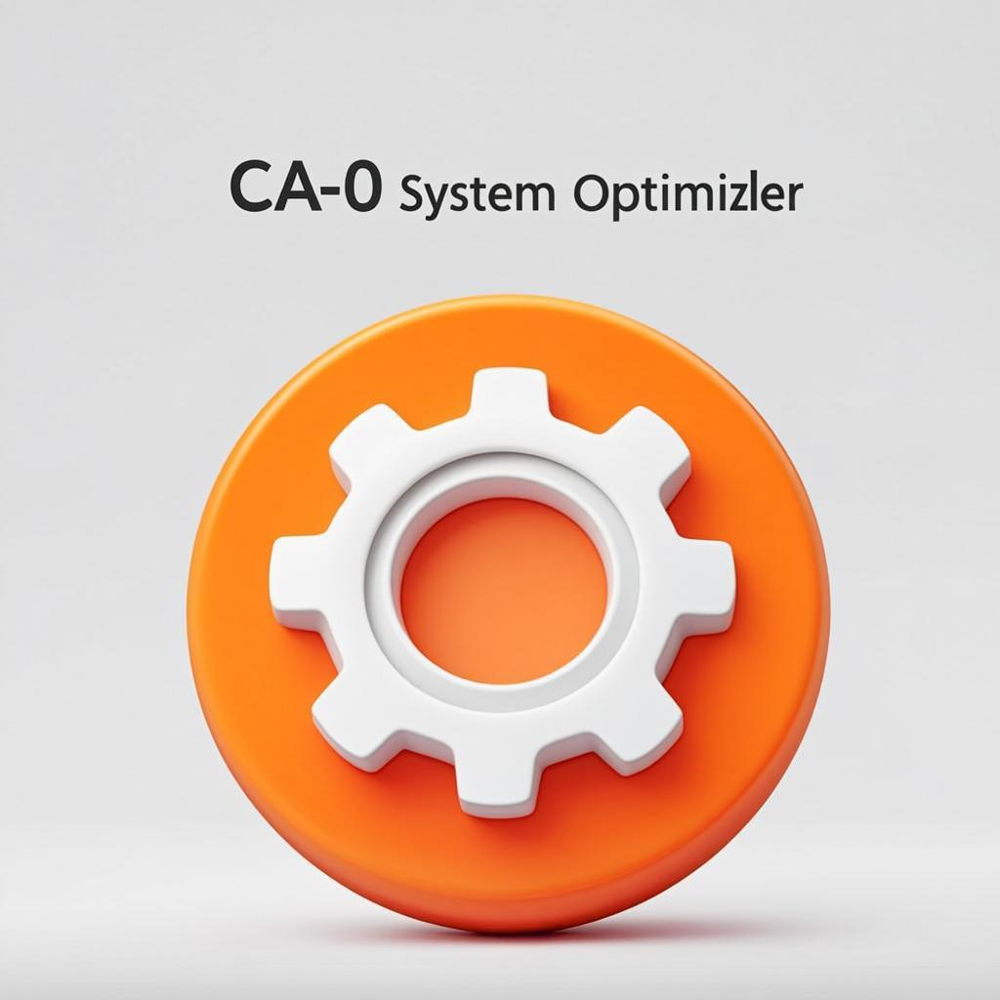

# 🖥️ CA-O - Windows Optimization Tool

<p align="center">
  
</p>

<p align="center">
  <strong>Optimización Avanzada de Sistema Windows</strong><br>
  <em>Advanced Windows System Optimization</em>
</p>

---

<p align="center">
  
  
  
  
  
  <a href="#-table-of-contents"></a>
</p>

---

## ✨ Project Overview / Descripción del Proyecto

<div align="center">

```
╔══════════════════════════════════════════════════════════════════╗
║                                                                  ║
║   🔧 CA-O Windows Optimization Tool                              ║
║   ─────────────────────────────────────                          ║
║                                                                  ║
║   🚀 16 verified executable optimizations                         ║
║   🌐 ExitLag-style Network Optimization                         ║
║   🎮 Input Lag Reduction for Gaming                             ║
║   ⚡ Real-time System Monitoring                                ║
║   🎨 Modern Glassmorphism UI                                    ║
║   🌍 Bilingual: Spanish / English                               ║
║                                                                  ║
╚══════════════════════════════════════════════════════════════════╝
```

</div>

**CA-O** (Configuración Avanzada y Optimización) is a comprehensive, professional-grade Windows optimization tool designed to help users maximize their system's performance through carefully curated tweaks and adjustments. Whether you're a gamer seeking lower latency, a power user wanting a snappier system, or someone who simply wants to clean up their Windows installation — **CA-O has you covered**.

### Key Highlights:

| Feature | Description |
|---------|-------------|
| 🎯 **Precision Tuning** | Registry-level optimizations for maximum impact |
| 🛡️ **Safety First** | Risk classification system with clear warnings |
| ↩️ **Verified Reverts** | Reversible changes include a verified revert path |
| 📊 **Real-time Monitoring** | Live CPU, RAM, and system metrics |
| 💾 **History Tracking** | Complete log of all changes made |
| 🌙 **Modern UI** | Beautiful dark/light theme with glassmorphism |

---

## 📋 Table of Contents / Índice de Contenidos

- [✨ Project Overview](#-project-overview--descripción-del-proyecto)
- [🚀 Features Overview](#-features-overview--características-principales)
- [📸 Screenshots](#-screenshots--capturas-de-pantalla)
- [💻 System Requirements](#-system-requirements--requisitos-del-sistema)
- [📦 Installation Guide](#-installation-guide--guía-de-instalación)
- [🏃 Quick Start Guide](#-quick-start-guide--inicio-rápido)
- [📊 Optimization Categories](#-optimization-categories--categorías-de-optimización)
  - [Category A: System Optimizations](#-category-a-windows-system-optimizations--sistema)
  - [Category B: Network Optimizations](#-category-b-network-optimizations--estilo-exitlag)
  - [Category C: Input Optimizations](#-category-c-input-optimizations--mouse--teclado)
  - [Category D: Visual Tweaks](#-category-d-visual-tweaks--ajustes-visuales)
  - [Category E: Advanced Power Optimizations](#-category-e-advanced-power-optimizations--⚠️-warning)
- [📖 Usage Guide](#-usage-guide--guía-de-uso)
- [⚠️ Safety Guide](#️-safety-guide--guía-de-seguridad)
- [🔧 Troubleshooting](#-troubleshooting--solución-de-problemas)
- [❓ FAQ](#-faq--preguntas-frecuentes)
- [🔬 Technical Details](#-technical-details--detalles-técnicos)
- [🤝 Contributing](#-contributing--contribuir)
- [📄 License](#-license--licencia)
- [📜 Version History](#-version-history--historial-de-versiones)
- [🙏 Credits](#-credits--créditos)
- [📞 Contact/Support](#-contactsupport--soporte)

---

## 🚀 Features Overview / Características Principales

### Core Features / Características Principales

| Feature | Spanish | Description |
|---------|---------|-------------|
| 🔧 **16 verified optimizations** | 16 optimizaciones verificadas | Changes with execution and verification contracts |
| 🖥️ **System Optimization** | Optimización de Sistema | Disable telemetry, services, background processes |
| 🌐 **Network Enhancement** | Mejora de Red | ExitLag-style latency reduction and bandwidth optimization |
| 🖱️ **Input Response** | Respuesta de Entrada | Mouse acceleration disable, keyboard optimization |
| 🎨 **Visual Tweaks** | Ajustes Visuales | Clean up UI, reduce rendering overhead |
| ⚡ **Advanced Power** | Energía Avanzada | High-performance power plans, GPU scheduling |

### User Experience Features / Funcionalidades de Usuario

| Feature | Icon | Description |
|---------|------|-------------|
| **Real-time Monitoring** | 📊 | Live dashboard showing CPU, RAM, disk usage |
| **One-click Profiles** | 👤 | Pre-configured optimization presets for different use cases |
| **Health Score** | ❤️ | System health assessment based on applied optimizations |
| **Optimization History** | 📜 | Complete timeline of all changes with timestamps |
| **Undo Functionality** | ↩️ | Revert any single optimization or all at once |
| **Search & Filter** | 🔍 | Quickly find specific optimizations |
| **Keyboard Shortcuts** | ⌨️ | Power user navigation shortcuts |
| **Dark/Light Theme** | 🌙 | Beautiful glassmorphism UI with theme switching |
| **Bilingual Support** | 🌍 | Full Spanish and English localization |
| **Local Export** | 💾 | Download JSON and CSV reports locally |
| **Scheduler** | ⏰ | Configure scheduling UI; execution integration is still pending |
| **Achievement System** | 🏆 | Gamification for exploring features |

### Technical Features / Características Técnicas


| Technology | Purpose |
|------------|---------|
| **Next.js 16** | React framework with App Router |
| **React 19** | Latest React with concurrent features |
| **TypeScript** | Type-safe development |
| **Tailwind CSS 4** | Utility-first styling |
| **shadcn/ui** | Beautiful, accessible components |
| **Zustand** | Lightweight state management |
| **Prisma ORM** | Database management |
| **Framer Motion** | Smooth animations |
| **Recharts** | Data visualization |
| **next-intl** | Internationalization |

---

## 📸 Screenshots / Capturas de Pantalla

> **Note:** Screenshots are available in the `/download` folder of this repository.

### Main Interface Views

| View | Description | Screenshot Reference |
|------|-------------|---------------------|
| **Dashboard** | Main overview with health score, system metrics, quick actions | `ca-o-dashboard.png`, `ca-o-dashboard-v2.png`, `ca-o-dashboard-full.png` |
| **Optimization Center** | Category view with all available optimizations | `ca-o-optimization.png`, `ca-o-enhanced.png` |
| **Optimization Cards** | Detailed cards for each category | `ca-o-cards-v2.png`, `ca-o-qa-cards.png` |
| **Settings Panel** | Configuration options, themes, language | `ca-o-settings.png` |
| **Troubleshooting** | Recovery tools and restore points | `ca-o-troubleshoot.png` |
| **Help Modal** | In-app documentation and guidance | `ca-o-help-modal.png` |

### UI Components Preview

```
┌─────────────────────────────────────────────────────────────────┐
│  🏠 Dashboard │ 🔧 Optimize │ 🔧 Troubleshoot │ ⚙️ Settings   │
├─────────────────────────────────────────────────────────────────┤
│                                                                 │
│   ┌─────────────────┐  ┌─────────────────┐  ┌───────────────┐  │
│   │   ❤️ Health     │  │   📊 CPU       │  │   💾 RAM      │  │
│   │     Score       │  │    Usage        │  │    Usage      │  │
│   │     85/100      │  │     34%         │  │    12.4 GB    │  │
│   └─────────────────┘  └─────────────────┘  └───────────────┘  │
│                                                                 │
│   ═════════ OPTIMIZATION CATEGORIES ═════════                   │
│                                                                 │
│   ┌──────────┐ ┌──────────┐ ┌──────────┐ ┌──────────┐ ┌──────┐│
│   │ ⚙️ Sys   │ │ 🌐 Net   │ │ 🎮 Inp   │ │ 🎨 Vis   │ │⚡Adv ││
│   │  20 items│ │ 20 items │ │ 20 items │ │ 20 items │ │ 20 itm││
│   └──────────┘ └──────────┘ └──────────┘ └──────────┘ └──────┘│
│                                                                 │
└─────────────────────────────────────────────────────────────────┘
```

---

## 💻 System Requirements / Requisitos del Sistema

### Minimum Requirements / Requisitos Mínimos

| Component | Minimum Specification |
|-----------|----------------------|
| **Operating System** | Windows 10 (version 1903+) or Windows 11 |
| **Processor** | Any modern 64-bit CPU (Intel i3 / AMD Ryzen 3 or equivalent) |
| **RAM** | 4 GB minimum |
| **Storage** | 500 MB free space for application + dependencies |
| **Display** | 1280x720 minimum resolution |
| **Browser** | Chrome 90+, Edge 90+, Firefox 88+ (for web version) |
| **Runtime** | Node.js 18+ (for development/self-hosting) |

### Recommended Specifications / Recomendado

| Component | Recommended Specification |
|-----------|--------------------------|
| **Operating System** | Windows 11 23H2 or later |
| **Processor** | Intel i5 / AMD Ryzen 5 or better (6+ cores) |
| **RAM** | 16 GB DDR4/DDR5 |
| **Storage** | SSD with 1 GB free space |
| **Display** | 1920x1080 (Full HD) or higher |
| **GPU** | Dedicated GPU with hardware acceleration support |
| **Network** | Stable internet connection for updates |

### Compatibility Matrix / Matriz de Compatibilidad

| Feature | Windows 10 | Windows 11 |
|---------|:----------:|:----------:|
| All System Optimizations | ✅ | ✅ |
| Network Optimizations | ✅ | ✅ |
| Input Optimizations | ✅ | ✅ |
| Visual Tweaks | ✅ | ✅ |
| Advanced Power Options | ✅ | ✅ |
| Widgets Disabling | ❌ N/A | ✅ |
| Chat/Teams Hiding | ❌ N/A | ✅ |
| Aero Peek Controls | ✅ | ✅ Modified |

---

## 📦 Installation Guide / Guía de Instalación

### Option A: Web Version (Recommended) / Versión Web (Recomendada)

This option runs CA-O as a local web application using Node.js.

#### Prerequisites / Prerrequisitos

```bash
# Check if Node.js is installed (requires version 18 or higher)
node --version
# Expected output: v18.x.x or higher

# Alternative: Install via nvm (Node Version Manager)
# Download from: https://github.com/nvm-sh/nvm (Windows: https://github.com/coreybutler/nvm-windows)

# Or install Bun for faster performance
# Download from: https://bun.sh/
bun --version
```

#### Step-by-Step Installation / Instalación Paso a Paso

```bash
# 1. Clone the repository or download the ZIP archive
git clone https://github.com/your-org/ca-o-optimization-tool.git
cd ca-o-optimization-tool

# 2. Install dependencies (using npm, yarn, pnpm, or bun)
npm install        # Standard npm
# OR
yarn install       # Using Yarn
# OR
pnpm install       # Using pnpm (fastest)
# OR
bun install        # Using Bun (fastest)

# 3. Set up the database (SQLite via Prisma)
npm run db:push

# 4. Start the development server
npm run dev

# 5. Open your browser and navigate to:
#    http://localhost:3000
```

#### Available Scripts / Scripts Disponibles

| Command | Description |
|---------|-------------|
| `npm run dev` | Start development server on port 3000 |
| `npm run build` | Build production bundle |
| `npm run start` | Start production server |
| `npm run lint` | Run ESLint code quality checks |
| `npm run db:push` | Push schema changes to database |
| `npm run db:generate` | Generate Prisma client |
| `npm run db:migrate` | Run database migrations |
| `npm run db:reset` | Reset database to initial state |

---

### Option B: Desktop Application (.exe) / Aplicación de Escritorio

> **Status:** 🚧 Under Development / En Desarrollo  
> **ETA:** Coming Soon / Próximamente

The desktop version will be built using **Electron** and distributed as a standalone `.exe` file.

**Planned Features:**
- ✅ No need to install Node.js
- ✅ Single executable file
- ✅ System tray integration
- ✅ Auto-update capability
- ✅ Native Windows notifications
- ✅ Admin elevation prompts when needed

**Preview Command (when available):**
```bash
# Build desktop app (future)
npm run build:electron
# Output: dist/ca-o-setup.exe
```

---

### Option C: Pre-built Package / Paquete Pre-compilado

For users who prefer not to install development tools:

1. **Download** the latest release from the [Releases page](#)
2. **Extract** the ZIP archive to a location of your choice
3. **Run** `start.bat` (Windows) or `start.sh` (WSL/Linux)
4. **Open** http://localhost:3000 in your browser

**Package Contents:**
```
ca-o-v0.2.1/
├── .next/              # Pre-built Next.js application
├── public/             # Static assets
├── node_modules/       # Dependencies (included)
├── start.bat           # Windows launcher
├── start.sh            *nix launcher
└── README.txt          # Quick start instructions
```

---

## 🏃 Quick Start Guide / Inicio Rápido

Follow these steps to get started with CA-O quickly:

### Step 1: Launch the Application / Iniciar la Aplicación

```
┌────────────────────────────────────────────────────────────┐
│                                                            │
│   🔄 Loading CA-O...                                      │
│   ████████████████████████████████░░░░ 85%                │
│                                                            │
│   "Preparing optimization modules..."                      │
│                                                            │
└────────────────────────────────────────────────────────────┘
```

After launching, you'll see the **Splash Screen** followed by an optional **Onboarding Wizard** for first-time users.

### Step 2: View Your Dashboard / Ver el Panel Principal

Upon entering the main interface, you'll see:

- **Health Score**: Overall system optimization status (0-100)
- **System Metrics**: Real-time CPU, RAM, Disk usage
- **Quick Actions**: Common tasks like "Optimize Now", "Create Restore Point"
- **Recent Activity**: Last applied optimizations

### Step 3: Navigate to Optimization Center / Ir al Centro de Optimización

Click on **"Optimización"** in the navigation bar (or press `2` key).

You'll see 5 category cards:

| Category | Color | Items | Risk Level |
|----------|-------|-------|------------|
| ⚙️ System | Blue | 20 | Mostly Safe |
| 🌐 Network | Green | 20 | Safe |
| 🎮 Input | Purple | 20 | Safe |
| 🎨 Visual | Amber | 20 | Safe |
| ⚡ Advanced | Red | 20 | ⚠️ Warning |

### Step 4: Select a Category / Seleccionar una Categoría

Click on any category card to expand it and see all available optimizations.

Each optimization shows:
- ✅ Name (in your selected language)
- 📝 Brief description
- 🟢🟡🔴 Risk level indicator
- 📊 Performance impact rating
- ✓/✗ Applied status checkbox

### Step 5: Review Before Applying / Revisar Antes de Aplicar

**Best Practice:** Always review what each optimization does before applying!

Click on any optimization to see detailed information:
- **What Is It?** / ¿Qué es? - Explanation of the feature
- **What It Applies To** / A qué afecta - Affected systems
- **Registry Keys** (if applicable)
- **Commands** (if applicable)
- **Services** affected (if applicable)

### Step 6: Apply Safe Optimizations First / Aplicar Optimizaciones Seguras Primero

```
RECOMMENDED ORDER OF APPLICATION:
━━━━━━━━━━━━━━━━━━━━━━━━━━━━━━━━━

1️⃣  Create a Restore Point FIRST!
    ↓
2️⃣  Apply Category A (System) - Safe items only
    ↓
3️⃣  Apply Category B (Network) - All items safe
    ↓
4️⃣  Apply Category C (Input) - All items safe
    ↓
5️⃣  Apply Category D (Visual) - Personal preference
    ↓
6️⃣  Review Category E (Advanced) CAREFULLY
    ↓
7️⃣  Apply Category E items one by one if needed
    ↓
8️⃣  Restart your computer
```

### Step 7: Advanced Options / Opciones Avanzadas

<details>
<summary>🔧 Click to expand advanced usage tips</summary>

#### Bulk Operations
- **Apply All in Category**: Use the "Apply All" button at category top
- **Apply Only Safe**: Filter by risk level first, then bulk apply
- **Select Multiple**: Hold Ctrl/Cmd + click to select multiple items

#### Profile System
Pre-configured profiles for common use cases:
- **Gaming Profile**: All input + network + advanced gaming tweaks
- **Productivity Profile**: System cleanup + visual tweaks
- **Privacy Focus**: Telemetry disabling + data collection blocking
- **Maximum Performance**: Everything except dangerous items

#### Keyboard Shortcuts
| Key | Action |
|-----|--------|
| `1` | Go to Dashboard |
| `2` | Go to Optimization |
| `3` | Go to Troubleshooting |
| `4` | Go to Settings |
| `Ctrl+K` | Open Command Palette |
| `Ctrl+S` | Quick save current state |
| `Ctrl+Z` | Undo last action |
| `?` | Show keyboard shortcuts help |

</details>

---

## 📊 Optimization Categories / Categorías de Optimización

### 🖥️ Category A: Windows System Optimizations / Sistema

**Description:** Core operating system optimizations that improve overall Windows performance by disabling unnecessary services, cleaning temporary files, and reducing background activity.

| # | ID | Optimization | Descripción | Risk | Impact | Safe |
|---|-----|-------------|-------------|------|--------|------|
| 1 | sys-001 | **Disable Telemetry & Diagnostics** | Stops Microsoft data collection and diagnostic tracking | 🟢 Low | Medium | ✅ |
| 2 | sys-002 | **Disable Windows Error Reporting** | Disables crash report generation service | 🟢 Low | Low | ✅ |
| 3 | sys-003 | **Disable SysMain/Superfetch** | Stops pre-loading service that consumes RAM/CPU | 🟢 Low | Medium | ✅ |
| 4 | sys-004 | **Disable Windows Search Indexing** | Stops file indexing service (high disk I/O) | 🟢 Low | High | ✅ |
| 5 | sys-005 | **Speed Up Shutdown** | Reduces service wait time from 20s to 2s | 🟢 Low | Medium | ✅ |
| 6 | sys-006 | **Disable Lock Screen** | Removes decorative lock screen before login | 🟢 Low | Low | ✅ |
| 7 | sys-007 | **Disable Cortana** | Completely disables virtual assistant | 🟢 Low | Medium | ✅ |
| 8 | sys-008 | **Disable Widgets (Win11)** | Removes Widgets panel from Win11 | 🟢 Low | Medium | ✅ |
| 9 | sys-009 | **Disable Chat/Teams (Win11)** | Hides Teams icon from taskbar | 🟢 Low | Low | ✅ |
| 10 | sys-010 | **Disable Fax & Print Services** | Disables unused printing services | 🟢 Low | Low | ✅ |
| 11 | sys-011 | **Clean Windows Temp Files** | Deletes %WINDIR%\Temp contents | 🟢 Low | Low | ✅ |
| 12 | sys-012 | **Clean User Temp Files** | Deletes %TEMP% contents | 🟢 Low | Low | ✅ |
| 13 | sys-013 | **Clean Prefetch Folder** | Clears application preload cache | 🟢 Low | Low | ✅ |
| 14 | sys-014 | **Disable Recent Documents History** | Prevents saving recent files list | 🟢 Low | Low | ✅ |
| 15 | sys-015 | **Disable Xbox Services** | Disables 4 Xbox background services | 🟢 Low | Medium | ✅ |
| 16 | sys-016 | **Disable Biometric Services** | Disables WbioSrvc if not using Hello | 🟡 Low | Low | ✅ |
| 17 | sys-017 | **Disable Automatic App Downloads** | Blocks suggested app downloads | 🟢 Low | Medium | ✅ |
| 18 | sys-018 | **Disable System Notification Messages** | Blocks push-to-install notifications | 🟢 Low | Low | ✅ |
| 19 | sys-019 | **Force Close Apps on Shutdown** | Auto-closes apps without confirmation | 🟢 Low | Medium | ✅ |
| 20 | sys-020 | **Disable Minimize/Maximize Animations** | Removes window animation delays | 🟢 Low | Low | ✅ |

**Total Category A Items:** 20 optimizations  
**Safe to Apply:** 20/20 (100%)  
**Requires Reboot:** Some items

---

### 🌐 Category B: Network Optimizations / Estilo ExitLag

**Description:** ExitLag-inspired network optimizations designed to reduce latency, increase throughput, and optimize TCP/IP settings for gaming and real-time applications.

| # | ID | Optimization | Descripción | Risk | Impact | Safe |
|---|-----|-------------|-------------|------|--------|------|
| 1 | net-001 | **Disable Nagle's Algorithm** | Combines small TCP packets faster for lower latency | 🟢 Low | High | ✅ |
| 2 | net-002 | **Disable Network Throttling** | Removes 20% bandwidth reservation for QoS | 🟢 Low | High | ✅ |
| 3 | net-003 | **Flush DNS Cache** | Clears stale DNS resolution data | 🟢 Low | Low | ✅ |
| 4 | net-004 | **Set Cloudflare Gaming DNS** | Configures 1.1.1.1 for low-latency DNS | 🟢 Low | High | ✅ |
| 5 | net-005 | **Set Google DNS** | Configures 8.8.8.8 as fast alternative DNS | 🟢 Low | High | ✅ |
| 6 | net-006 | **Enable ECN** | Explicit Congestion Notification for better handling | 🟢 Low | Medium | ✅ |
| 7 | net-007 | **Disable TCP Auto-Tuning** | Fixes latency issues in some network configs | 🟢 Low | Medium | ✅ |
| 8 | net-008 | **Enable CTCP (Compound TCP)** | Maximizes throughput on high-speed connections | 🟢 Low | High | ✅ |
| 9 | net-009 | **Disable IPv6** | Disables IPv6 if only using IPv4 networks | 🟢 Low | Medium | ✅ |
| 10 | net-010 | **Disable LLMNR** | Reduces unnecessary multicast traffic | 🟡 Low | Low | ✅ |
| 11 | net-011 | **Disable NetBIOS over TCP/IP** | Removes legacy protocol overhead | 🟢 Low | Low | ✅ |
| 12 | net-012 | **Prioritize Game Traffic QoS** | Reserves 0% bandwidth for system | 🟢 Low | High | ✅ |
| 13 | net-013 | **Disable Windows Update P2P** | Prevents sharing updates via P2P | 🟢 Low | Medium | ✅ |
| 14 | net-014 | **Enable RSS (Receive Side Scaling)** | Multi-core network packet processing | 🟢 Low | High | ✅ |
| 15 | net-015 | **Disable Wi-Fi Power Saving** | Keeps Wi-Fi adapter at full performance | 🟢 Low | Medium | ✅ |
| 16 | net-016 | **Reset Winsock** | Repairs network catalog corruption | 🟢 Low | Medium | ✅ |
| 17 | net-017 | **Increase TCP Half-Open Connections** | Raises connection limit for P2P/gaming | 🟡 Low | Medium | ✅ |
| 18 | net-018 | **Disable Network Location Detection** | Stops constant network monitoring | 🟢 Low | Low | ✅ |
| 19 | net-019 | **Clear ARP Cache** | Resolves MAC address resolution issues | 🟢 Low | Low | ✅ |
| 20 | net-020 | **Disable Explorer Network Tasks** | Prevents background network scanning | 🟢 Low | Medium | ✅ |

**Total Category B Items:** 20 optimizations  
**Safe to Apply:** 20/20 (100%)  
**Gaming Impact:** Very High ⭐⭐⭐⭐⭐

---

### 🖱️ Category C: Input Optimizations / Mouse & Teclado

**Description:** Mouse and keyboard optimizations for improved response times, precision control, and reduced input lag—essential for gaming and productivity.

| # | ID | Optimization | Descripción | Risk | Impact | Safe |
|---|-----|-------------|-------------|------|--------|------|
| 1 | inp-001 | **Disable Mouse Acceleration** | Enables precise 1:1 cursor movement | 🟢 Low | High | ✅ |
| 2 | inp-002 | **Set Mouse Polling Rate to 1000Hz** | Maximum USB polling for lowest latency | 🟢 Low | High | ✅ |
| 3 | inp-003 | **Reduce Menu Show Delay** | Sets MenuShowDelay=0 (instant menus) | 🟢 Low | Medium | ✅ |
| 4 | inp-004 | **Disable Hover Select in Explorer** | Requires click to select files | 🟢 Low | Low | ✅ |
| 5 | inp-005 | **Reduce Keyboard Repeat Delay** | Minimizes time before key repeat starts | 🟢 Low | Medium | ✅ |
| 6 | inp-006 | **Increase Keyboard Repeat Rate** | Maximizes key repeat speed (31) | 🟢 Low | Medium | ✅ |
| 7 | inp-007 | **Disable Predictive Text Filtering** | Turns off text prediction services | 🟢 Low | Low | ✅ |
| 8 | inp-008 | **Increase Keyboard Buffer Size** | Larger buffer prevents missed keystrokes | 🟢 Low | Medium | ✅ |
| 9 | inp-009 | **Disable Bing Search (Win+C)** | Removes Cortana/Bing keyboard shortcut | 🟢 Low | Low | ✅ |
| 10 | inp-010 | **Disable Loading Cursor Animation** | Static cursor instead of spinning circle | 🟢 Low | Low | ✅ |
| 11 | inp-011 | **Snap Pointer Precision to Pixel** | Forces pixel-aligned cursor positioning | 🟢 Low | Medium | ✅ |
| 12 | inp-012 | **Disable Inactive Window Scrolling** | Scroll only in focused window | 🟢 Low | Low | ✅ |
| 13 | inp-013 | **Disable Tablet PC Services** | Disables touch/pen input services | 🟢 Low | Low | ✅ |
| 14 | inp-014 | **Disable Sticky/Filter Keys** | Prevents accidental accessibility activation | 🟢 Low | Low | ✅ |
| 15 | inp-015 | **Disable Keyboard Beep Sounds** | Removes system beep audio | 🟢 Low | Low | ✅ |
| 16 | inp-016 | **Disable GameBar Keyboard Interception** | Frees global shortcuts from GameBar | 🟢 Low | Medium | ✅ |
| 17 | inp-017 | **Force Game Mode on Inputs** | Prioritizes game input processing | 🟢 Low | High | ✅ |
| 18 | inp-018 | **Reduce USB Latency** | Disables USB selective suspend | 🟢 Low | High | ✅ |
| 19 | inp-019 | **Disable Mouse Scroll Acceleration** | Linear, predictable scrolling | 🟢 Low | Medium | ✅ |
| 20 | inp-020 | **Clear Input Event Queue** | Flushes pending input events | 🟢 Low | Medium | ✅ |

**Total Category C Items:** 20 optimizations  
**Safe to Apply:** 20/20 (100%)  
**Gaming Impact:** Very High ⭐⭐⭐⭐⭐

---

### ⚙️ Category D: Visual Tweaks / Ajustes Visuales

**Description:** Visual customization options to clean up the Windows interface, reduce GPU rendering overhead, and create a distraction-free environment.

| # | ID | Optimization | Descripción | Risk | Impact | Safe |
|---|-----|-------------|-------------|------|--------|------|
| 1 | vis-001 | **Show File Extensions** | Displays .exe, .txt extensions in Explorer | 🟢 Low | Low | ✅ |
| 2 | vis-002 | **Show Hidden Files** | Reveals hidden system files/folders | 🟢 Low | Low | ✅ |
| 3 | vis-003 | **Disable Taskbar Preview (Aero Peek)** | Disables window transparency preview | 🟢 Low | Low | ✅ |
| 4 | vis-004 | **Reduce Window Transparency** | Minimizes GPU compositing effects | 🟢 Low | Medium | ✅ |
| 5 | vis-005 | **Disable Dynamic Wallpaper Slideshow** | Stops wallpaper rotation | 🟢 Low | Low | ✅ |
| 6 | vis-006 | **Use Solid Color Wallpaper** | No image decoding/rendering needed | 🟢 Low | Low | ✅ |
| 7 | vis-007 | **Disable System Sounds** | Mutes Windows event sounds | 🟢 Low | Low | ✅ |
| 8 | vis-008 | **Hide Desktop Icons** | Clean desktop appearance | 🟢 Low | Low | ✅ |
| 9 | vis-009 | **Disable Tooltips** | Removes hover information popups | 🟢 Low | Low | ✅ |
| 10 | vis-010 | **Change PC Name (Shorter)** | Better local DNS resolution | 🟢 Low | Low | ✅ |
| 11 | vis-011 | **Disable People Bar** | Hides contacts from taskbar | 🟢 Low | Low | ✅ |
| 12 | vis-012 | **Disable Windows Suggestions** | Blocks Start menu suggestions | 🟢 Low | Low | ✅ |
| 13 | vis-013 | **Disable Recent Apps History** | Clears app history tracking | 🟢 Low | Low | ✅ |
| 14 | vis-014 | **Hide 3D Objects Folder** | Removes unused Paint 3D folder | 🟢 Low | Low | ✅ |
| 15 | vis-015 | **Hide Music Folder** | Optional navigation pane cleanup | 🟢 Low | Low | ✅ |
| 16 | vis-016 | **Reduce Desktop Icon Density** | Better spacing between icons | 🟢 Low | Low | ✅ |
| 17 | vis-017 | **Disable File Thumbnails** | Uses icons instead of image previews | 🟢 Low | Medium | ✅ |
| 18 | vis-018 | **Hide Task View Button** | Removes button from taskbar | 🟢 Low | Low | ✅ |
| 19 | vis-019 | **Disable Taskbar Search Box** | Frees taskbar space | 🟢 Low | Low | ✅ |
| 20 | vis-020 | **Remove Hidden Tray Icons** | Cleans system tray area | 🟢 Low | Low | ✅ |

**Total Category D Items:** 20 optimizations  
**Safe to Apply:** 20/20 (100%)  
**Personal Preference:** Many items are subjective

---

### 🚀 Category E: Advanced Power Optimizations / ⚠️ ADVERTENCIA

> ### ⚠️ WARNING / ADVERTENCIA IMPORTANT
> 
> **Category E contains high-impact optimizations that may affect system security or stability.**
> 
> - Always create a **Restore Point** before applying these
> - Read each description **carefully**
> - Some changes require **system reboot**
> - Certain options **reduce security** features
> - **Not recommended** for enterprise/corporate machines

| # | ID | Optimization | Descripción | Risk | Impact | Safe |
|---|-----|-------------|-------------|------|--------|------|
| 1 | adv-001 | **Disable VBS** ⚠️ | Virtualization-Based Security off (FPS gain) | 🟡 Warning | Very-High | ⚠️ |
| 2 | adv-002 | **Disable Core Isolation/HVCI** ⚠️ | Hypervisor Code Integrity off | 🟡 Warning | Very-High | ⚠️ |
| 3 | adv-003 | **Disable Microsoft Defender** ☠️ | **COMPLETELY disables antivirus** | 🔴 Dangerous | Very-High | ☠️ |
| 4 | adv-004 | **Disable SmartScreen** ⚠️ | Removes URL/app safety filter | 🟡 Warning | High | ⚠️ |
| 5 | adv-005 | **Enable Ultimate Performance Plan** | Hidden max performance power plan | 🟢 Safe | Very-High | ✅ |
| 6 | adv-006 | **Disable Hibernation** | Removes hiberfil.sys (frees GB) | 🟢 Safe | Medium | ✅ |
| 7 | adv-007 | **Disable Fast Startup** | Hybrid shutdown mode off | 🟢 Safe | Medium | ✅ |
| 8 | adv-008 | **Force GPU Hardware Acceleration** | Max GPU usage for rendering | 🟢 Safe | High | ✅ |
| 9 | adv-009 | **Disable BITS Background Transfer** | Stops background update downloads | 🟢 Safe | Medium | ✅ |
| 10 | adv-010 | **Force Physical CPU Usage** | Prioritize physical over logical cores | 🟢 Safe | High | ✅ |
| 11 | adv-011 | **Enable HAGS** | Hardware GPU Scheduling for lower latency | 🟢 Safe | High | ✅ |
| 12 | adv-012 | **Configure MSI Mode** | Message Signaled Interrupts for devices | 🟡 Warning | High | ✅ |
| 13 | adv-013 | **Increase Assigned VRAM** | More video memory for applications | 🟢 Safe | High | ✅ |
| 14 | adv-014 | **Disable Pagefile** ☠️ | **Removes virtual memory - CRASH RISK** | 🔴 Dangerous | Very-High | ☠️ |
| 15 | adv-015 | **Remove OEM Bloatware** | Uninstalls manufacturer pre-installed apps | 🟢 Safe | Medium | ✅ |
| 16 | adv-016 | **Disable Ransomware Protection** ⚠️ | Controlled folder access off | 🟡 Warning | High | ⚠️ |
| 17 | adv-017 | **Enable Developer Mode** | Sideloading and dev tools access | 🟡 Warning | Low | ✅ |
| 18 | adv-018 | **Set SystemResponsiveness=0** | Max foreground app priority | 🟢 Safe | High | ✅ |
| 19 | adv-019 | **Disable GPU Power Throttling** | Prevents GPU clock reduction | 🟢 Safe | High | ✅ |
| 20 | adv-020 | **Set Win32PrioritySeparation=26** | Optimized process priority quantum | 🟢 Safe | Medium | ✅ |

**Total Category E Items:** 20 optimizations  
**Safe to Apply:** ~14/20 (70%)  
**Use Extreme Caution With:** ☠️ marked items

---

## 📖 Usage Guide / Guía de Uso

### Basic Usage / Uso Básico

#### Navigation / Navegación

The application uses a clean, intuitive interface with four main sections accessible via the top navigation bar or keyboard shortcuts:

```
┌────────────────────────────────────────────────────────────────┐
│  Navigation Bar                                                │
├────────────────────────────────────────────────────────────────┤
│                                                                │
│  [🏠 Dashboard]  [🔧 Optimization]  [🔧 Troubleshoot]  [⚙️ Settings] │
│       ↑                ↑                    ↑              ↑    │
│       1                2                    3              4    │
│                                                                │
└────────────────────────────────────────────────────────────────┘
```

#### Applying Single Optimization / Aplicar Una Optimización

1. Navigate to **Optimization Center** (`2` key or click tab)
2. Select a **Category** (A-E)
3. Find the desired optimization
4. **Click the checkbox** or the row to select it
5. Click **"Apply"** button (or double-click the item)
6. Confirm the dialog if prompted
7. Wait for completion message

#### Applying Category-Wide / Aplicar por Categoría

1. Open a category
2. Click **"Apply All"** at the top of the category
3. Review the summary dialog showing all items to be applied
4. Confirm to proceed
5. Monitor progress bar

#### Bulk Actions / Acciones en Masa

<details>
<summary>📦 Bulk Operation Details</summary>

**Multi-Selection:**
- **Windows:** Hold `Ctrl` + click individual items
- **Range Selection:** Click first item, hold `Shift`, click last item
- **Select All in Category:** `Ctrl+A` within category

**Bulk Apply Selected:**
1. Select multiple items using methods above
2. Click **"Apply Selected"** button
3. Confirmation dialog lists all selected items

**Filter Then Apply:**
1. Use search/filter to show only desired items
2. Click **"Apply All Visible"**
3. Only filtered items will be applied

</details>

---

### Advanced Usage / Uso Avanzado

#### Creating Custom Profiles / Crear Perfiles Personalizados

CA-O allows you to create custom optimization profiles for different scenarios:

```javascript
// Example profile structure
const myGamingProfile = {
  name: "Competitive Gaming",
  description: "Max performance for esports",
  optimizations: [
    // All network optimizations
    ...networkOptimizations.map(opt => opt.id),
    // All input optimizations
    ...inputOptimizations.map(opt => opt.id),
    // Specific advanced items
    'adv-001', // Disable VBS
    'adv-005', // Ultimate Performance
    'adv-011', // Enable HAGS
    'adv-018', // SystemResponsiveness=0
  ]
};
```

**To create a profile:**
1. Go to **Settings** → **Profiles** tab
2. Click **"Create New Profile"**
3. Give it a name and description
4. Select optimizations to include
5. Save and use anytime

#### Exporting/Importing Settings / Exportar/Importar Configuración

**Export Current State:**
1. Settings → **Export/Import** tab
2. Click **"Export Configuration"**
3. Choose location and filename
4. Creates `.json` file with all settings

**Import Configuration:**
1. Settings → **Export/Import** tab
2. Click **"Import Configuration"**
3. Select previously exported `.json` file
4. Review changes before confirming

**File Format:**
```json
{
  "version": "0.2.1",
  "exportDate": "2024-01-15T10:30:00Z",
  "settings": {
    "theme": "dark",
    "language": "en",
    "autoApplySafe": true,
    "confirmBeforeApply": true
  },
  "appliedOptimizations": ["sys-001", "net-001", ...],
  "customProfiles": [...]
}
```

#### Scheduling Optimizations / Programar Optimizaciones

<details>
<summary>⏰ Scheduler Configuration</summary>

The built-in scheduler allows automatic optimization runs:

**Available Schedule Types:**
- **On Startup:** Apply optimizations when Windows boots
- **On Schedule:** Daily/Weekly at specified time
- **On Event:** Trigger when specific conditions met

**To set up scheduling:**
1. Go to **Settings** → **Scheduler** tab
2. Click **"Add Schedule"**
3. Choose trigger type
4. Select which optimizations/profile to apply
5. Configure timing/options
6. Enable the schedule

**Example Cron-like syntax (internal):**
```
# Run every day at 3:00 AM
0 3 * * *

# Run every Monday at startup
@weekly @boot
```

</details>

---

## ⚠️ Safety Guide / Guía de Seguridad

> ### 🛡️ IMPORTANT SAFETY INFORMATION
> 
> Please read this section carefully before applying any optimizations.

### Risk Level Explanation / Explicación de Niveles de Riesgo

| Level | Symbol | Meaning | Action Required |
|-------|--------|---------|-----------------|
| **Safe** | 🟢 | Can be applied without concerns | None - Apply freely |
| **Warning** | 🟡 | May affect some functionality | Read description, backup recommended |
| **Dangerous** | 🔴 | Can compromise security/stability | **Backup required**, understand implications |

### Which Optimizations Are Safe? / ¿Cuáles son Seguras?

#### ✅ SAFE TO APPLY (Categories A-D mostly)

These optimizations have been tested and are considered safe for general use:

**Always Safe:**
- Telemetry disabling
- Service disabling (non-critical)
- Temporary file cleaning
- Visual tweaks
- Network optimizations (B)
- Input optimizations (C)
- Most power settings

#### ⚠️ USE WITH CAUTION (Some Category E items)

These optimizations trade security/performance:

| Optimization | Trade-off | Recommendation |
|--------------|-----------|----------------|
| Disable VBS | Loses Memory Integrity | OK for gaming PCs |
| Disable HVCI | Loses kernel protection | OK for offline/gaming |
| Disable SmartScreen | Loses download protection | Use alternative antivirus |
| Disable Ransomware Protection | Loses folder protection | Keep backups elsewhere |

#### ☠️ DANGEROUS (Expert Only)

| Optimization | Risk | When Might Be Acceptable |
|--------------|------|------------------------|
| **Disable Defender** | No real-time protection | Air-gapped PC, temporary gaming session |
| **Disable Pagefile** | System crash if OOM | 32GB+ RAM, very specific workloads |

### Best Practices / Mejores Prácticas

```
╔══════════════════════════════════════════════════════════════╗
║                                                              ║
║   📋 PRE-OPTIMIZATION CHECKLIST                              ║
║   ─────────────────────────────────                           ║
║                                                              ║
║   □ Create a System Restore Point                            ║
║   □ Back up important files                                  ║
║   □ Note current system state (screenshots help)             ║
║   □ Close all running applications                          ║
║   □ Save any open work                                       ║
║   □ Ensure stable power (laptop plugged in)                 ║
║   □ Have installation media ready (just in case)            ║
║                                                              ║
╚══════════════════════════════════════════════════════════════╝
```

### Creating a Restore Point / Crear Punto de Restauración

**Method 1: Through CA-O**
1. Go to **Troubleshooting** section
2. Click **"Create Restore Point"**
3. Enter descriptive name (e.g., "Before CA-O optimization")
4. Wait for confirmation

**Method 2: Manual (Windows)**
```powershell
# PowerShell Administrator
Enable-ComputerRestore -Drive "C:\"
Checkpoint-Computer -Description "Before CA-O optimization" -RestorePointType "MODIFY_SETTINGS"
```

**Method 3: GUI (Windows)**
1. Press `Win + S`, search "Create a restore point"
2. Click "Configure..." ensure protection is ON
3. Click "Create..."
4. Enter name and confirm

### Backup Registry / Respaldo del Registro

For advanced users making registry changes:

```batch
:: Backup registry before major changes
reg export HKLM\SOFTWARE\Microsoft\Windows "%USERPROFILE%\Desktop\registry_backup_%date:~0,4%%date:~5,2%%date:~8,2%.reg"

:: To restore:
reg import "%USERPROFILE%\Desktop\registry_backup_xxx.reg"
```

### If Something Goes Wrong / Si Algo Sale Mal

<details>
<summary>🔧 Recovery Procedures</summary>

**Option 1: Undo via CA-O**
1. Open CA-O
2. Go to **Optimization History** tab
3. Find the problematic optimization
4. Click **"Revert"** next to it

**Option 2: Full Revert**
1. Troubleshooting section
2. Click **"Full Restoration"**
3. Confirm - reverts ALL changes

**Option 3: System Restore**
1. Restart PC
2. Boot to Advanced Startup (Shift+Restart)
3. Troubleshoot → Advanced options → System Restore
4. Choose restore point created earlier

**Option 4: Manual Registry Fix**
```batch
:: Import registry backup
reg import backup.reg

:: Or reset specific keys
reg delete "HKLM\Path\To\Key" /v ValueName /f
```

**Option 5: Windows Repair/Reset (Last Resort)**
- Settings → Update & Security → Recovery
- "Reset this PC" (keep files)

</details>

---

## 🔧 Troubleshooting / Solución de Problemas

### Common Issues and Solutions / Problemas Comunes y Soluciones

#### Issue: Application Won't Start / La Aplicación No Inicia

**Symptoms:** Browser shows error, blank page, or loading forever

**Solutions:**

| Solution | Steps |
|----------|-------|
| **Check Node.js version** | Run `node --version` - must be 18+ |
| **Clear .next cache** | Delete `.next` folder, run `npm run dev` again |
| **Check port 3000** | Ensure nothing else uses port 3000 |
| **Check dependencies** | Run `rm -rf node_modules && npm install` |
| **Check logs** | Look at `dev.log` for errors |

```bash
# Full reset procedure
cd /path/to/ca-o
rm -rf .next node_modules
npm install
npm run db:push
npm run dev
```

---

#### Issue: Optimizations Not Applying / Las Optimizaciones No Se Aplican

**Symptoms:** Click apply but nothing happens, errors shown

**Solutions:**

| Cause | Solution |
|-------|----------|
| **Not running as admin** | Right-click terminal → "Run as administrator" |
| **Registry blocked** | Check if Group Policy blocks registry edits |
| **Service permissions** | Some services need elevated privileges |
| **Antivirus interference** | Temporarily exclude project folder from scans |

**For registry issues:**
```powershell
# Check if you can write to registry
reg query "HKLM\SOFTWARE\Microsoft\Windows"

# If access denied, run as administrator
```

---

#### Issue: How to Undo Changes / Cómo Deshacer Cambios

**Multiple undo options available:**

1. **Single optimization revert:**
   - History tab → Find optimization → Click "Revert"

2. **Category revert:**
   - Optimization view → Category header → "Revert Category"

3. **Full revert:**
   - Troubleshooting → "Full Restoration"

4. **Manual revert:**
   - Each optimization stores original values
   - Applied automatically on revert

---

#### Issue: Performance Problems After Optimization / Problemas de Rendimiento Después de Optimizar

**Symptoms:** System feels slower, features broken, instability

**Immediate Actions:**

```
1. DON'T PANIC - Changes are reversible
         ↓
2. Use "Full Restoration" in Troubleshooting section
         ↓
3. Restart your computer
         ↓
4. Test if issue resolved
         ↓
5. If not, use System Restore point
         ↓
6. Document which optimization caused issue
         ↓
7. Report bug to CA-O team
```

**Common culprits and fixes:**

| Symptom | Likely Cause | Fix |
|---------|--------------|-----|
| WiFi not working | IPv6 disabled, network tweaks | Revert Category B |
| Printers not working | Print Spooler stopped | Revert sys-010 |
| Games crashing | Pagefile disabled | Revert adv-014 immediately |
| Security warnings | Defender disabled | Revert adv-003, restart |
| Touch features broken | Tablet PC disabled | Revert inp-013 |

---

#### Issue: Network Problems After Network Tweaks / Problemas de Red Después de Optimizaciones de Red

**Symptoms:** Internet slow, can't connect, DNS errors

**Quick Fix:**
```batch
:: Reset all network adapters
netsh winsock reset
netsh int ip reset
ipconfig /flushdns
ipconfig /release
ipconfig /renew

:: Restart computer after running these
```

**Then in CA-O:**
1. Go to Category B (Network)
2. Click "Revert Category"
3. Restart PC

---

## ❓ FAQ / Preguntas Frecuentes

### General Questions / Preguntas Generales

<details>
<summary><strong>Q: Is this safe to use? / ¿Es seguro usar esto?</strong></summary>

**A:** Yes, for the most part! Categories A-D contain thoroughly tested optimizations that are safe for daily use. Category E contains some advanced options that carry more risk - these are clearly marked with warning symbols (⚠️) or danger symbols (☠️). We recommend creating a System Restore Point before applying ANY optimizations, especially from Category E.

**R:** ¡Sí, en su mayoría! Las categorías A-D contienen optimizaciones probadas que son seguras para uso diario. La categoría E contiene opciones avanzadas con mayor riesgo - están marcadas claramente con símbolos de advertencia.

</details>

<details>
<summary><strong>Q: Will this damage my Windows? / ¿Esto dañará mi Windows?</strong></summary>

**A:** CA-O blocks irreversible and guidance-only operations from the executable catalog. Reversible operations require a configured revert path and post-change verification; system changes still carry risk. This is why we strongly recommend:
1. Creating a restore point before starting
2. Reading what each optimization does
3. Starting with safe (green) optimizations first
4. Having a backup of important files

**R:** CA-O bloquea las operaciones irreversibles y las que solo sirven como guía. Las operaciones reversibles requieren una ruta de restauración y verificación posterior; cualquier cambio del sistema conserva riesgos.

</details>

<details>
<summary><strong>Q: Can I undo changes? / ¿Puedo deshacer los cambios?</strong></summary>

**A:** Absolutely! Every single optimization can be individually reverted. You can also:
- Revert an entire category at once
- Perform a full restoration of ALL changes
- Use the Optimization History to selectively undo past actions
- Use Windows System Restore as a last resort

**R:** ¡Absolutamente! Cada optimización puede revertirse individualmente. También puedes revertir toda una categoría o hacer una restauración completa.

</details>

<details>
<summary><strong>Q: Does this work on Windows 10? / ¿Funciona en Windows 10?</strong></summary>

**A:** Yes! CA-O supports both Windows 10 (version 1903 and later) and Windows 11. Some optimizations are specific to one OS (like Widgets disabling which is Win11-only), but the vast majority work on both systems.

**R:** ¡Sí! CA-O soporta tanto Windows 10 (versión 1903+) como Windows 11. Algunas optimizaciones son específicas de un sistema operativo.

</details>

<details>
<summary><strong>Q: Do I need to be administrator? / ¿Necesito ser administrador?</strong></summary>

**A:** Yes, many optimizations modify system-wide settings, services, and registry keys that require administrative privileges. You should run the application (or your terminal/command prompt) as Administrator for best results.

**R:** Sí, muchas optimizaciones modifican configuraciones del sistema que requieren privilegios administrativos. Debes ejecutar como Administrador.

</details>

<details>
<summary><strong>Q: How often should I optimize? / ¿Con qué frecuencia debo optimizar?</strong></summary>

**A:** There's no need to run optimizations repeatedly. Once applied, most settings persist until:
- You reinstall/upgrade Windows
- You revert the changes
- Another program overrides them

We recommend:
- Running CA-O after a fresh Windows install
- Re-checking after major Windows updates
- Running temp file cleaners monthly

**R:** No necesitas ejecutar las optimizaciones repetidamente. Una vez aplicadas, la mayoría de configuraciones persisten hasta que reinstales Windows o reviertas los cambios.

</details>

---

### Gaming-Specific Questions / Preguntas sobre Gaming

<details>
<summary><strong>Q: Will this improve gaming performance? / ¿Esto mejorará el rendimiento en juegos?</strong></summary>

**A:** Yes! Many optimizations specifically target gaming performance:

**Network (Category B):**
- Lower ping via Nagle's algorithm disable
- Reduced packet loss with TCP optimizations
- Faster DNS resolution

**Input (Category C):**
- Eliminated mouse acceleration for precise aim
- Reduced input lag with USB polling rate
- Faster keyboard response

**Advanced (Category E):**
- FPS boost from disabling VBS (5-15% in some games)
- GPU scheduling improvements
- Maximum performance power plan

**Expected improvements:**
- Network latency: 10-30% reduction possible
- Input responsiveness: Noticeably faster
- FPS: 5-15% average (varies by game/system)

**R:** ¡Sí! Muchas optimizaciones están específicamente diseñadas para mejorar el rendimiento en juegos.

</details>

<details>
<summary><strong>Q: What about anti-cheat systems? / ¿Qué hay de los sistemas anti-cheat?</strong></summary>

**A:** Most optimizations should not trigger anti-cheat systems since they don't modify game files. However:
- Some registry changes might be flagged by aggressive anti-cheat
- Category E items (especially VBS/HVCI disabling) could cause issues
- **Recommendation:** Test in non-competitive environments first
- If concerned, stick to Categories A-D which are generally safe

**R:** La mayoría de optimizaciones no deberían activar sistemas anti-cheat ya que no modifican archivos de juego. Sin embargo, algunos cambios podrían ser detectados por sistemas agresivos.

</details>

---

### Technical Questions / Preguntas Técnicas

<details>
<summary><strong>Q: What's the difference between web and .exe version? / ¿Cuál es la diferencia entre versión web y .exe?</strong></summary>

**A:** 

| Aspect | Web Version | Desktop (.exe) |
|--------|-------------|----------------|
| **Installation** | Requires Node.js | Standalone, no dependencies |
| **Interface** | Browser-based | Native window |
| **System Access** | Limited (browser sandbox) | Full system access |
| **Auto-start** | Manual launch | Can start with Windows |
| **Updates** | Manual git pull | Auto-update capable |
| **Portability** | Needs runtime | Single file |
| **Current Status** | ✅ Available | 🚧 In Development |

**R:** La versión web requiere Node.js y corre en navegador. La versión .exe será un archivo independiente sin dependencias, actualmente en desarrollo.

</details>

<details>
<summary><strong>Q: Does this collect any data? / ¿Esto recopila algún dato?</strong></summary>

**A:** CA-O is privacy-focused:
- **No telemetry** - ironic, right? 😄
- **No phone-home** - works completely offline
- **Local storage only** - data stays on your machine
- **Open source** - you can audit the code yourself

All optimization history is stored locally in SQLite database.

**R:** CA-O está enfocado en la privacidad. No tiene telemetría, funciona completamente offline, y todos los datos se almacenan localmente.

</details>

---

## 🔬 Technical Details / Detalles Técnicos

### Architecture Overview / Arquitectura General

```
┌─────────────────────────────────────────────────────────────────┐
│                        CA-O Architecture                        │
├─────────────────────────────────────────────────────────────────┤
│                                                                 │
│  ┌─────────────────────────────────────────────────────────┐   │
│  │                    Frontend Layer                       │   │
│  │  ┌──────────┐  ┌──────────┐  ┌──────────────────────┐  │   │
│  │  │ Next.js  │  │ React 19 │  │  Tailwind + shadcn   │  │   │
│  │  │ App Router│  │ Concurrent│  │  Glassmorphism UI   │  │   │
│  │  └──────────┘  └──────────┘  └──────────────────────┘  │   │
│  └─────────────────────────────────────────────────────────┘   │
│                              │                                  │
│                              ▼                                  │
│  ┌─────────────────────────────────────────────────────────┐   │
│  │                    API Layer                             │   │
│  │  ┌──────────────────────────────────────────────────┐   │   │
│  │  │           Next.js API Routes                     │   │   │
│  │  │  /api/optimization/*  /api/system/*  /api/registry*│   │   │
│  │  └──────────────────────────────────────────────────┘   │   │
│  └─────────────────────────────────────────────────────────┘   │
│                              │                                  │
│                              ▼                                  │
│  ┌─────────────────────────────────────────────────────────┐   │
│  │                    Data Layer                            │   │
│  │  ┌──────────┐  ┌──────────┐  ┌──────────────────────┐   │   │
│  │  │  Prisma  │  │ SQLite   │  │  Optimization Data   │   │   │
│  │  │   ORM    │  │ Database │  │  Type Definitions    │   │   │
│  │  └──────────┘  └──────────┘  └──────────────────────┘   │   │
│  └─────────────────────────────────────────────────────────┘   │
│                                                                 │
└─────────────────────────────────────────────────────────────────┘
```

### Technology Stack / Stack Tecnológico

| Layer | Technology | Version | Purpose |
|-------|------------|---------|---------|
| **Framework** | Next.js | 16.x | React meta-framework |
| **UI Library** | React | 19.x | Component rendering |
| **Language** | TypeScript | 5.x | Type safety |
| **Styling** | Tailwind CSS | 4.x | Utility-first CSS |
| **Components** | shadcn/ui | Latest | Accessible UI primitives |
| **State** | Zustand | 5.x | Client state management |
| **Database** | Prisma | 6.x | ORM & migrations |
| **Storage** | SQLite | Built-in | Local data persistence |
| **Charts** | Recharts | 2.x | Data visualization |
| **Animation** | Framer Motion | 12.x | Smooth transitions |
| **i18n** | next-intl | 4.x | Internationalization |
| **Icons** | Lucide React | Latest | Consistent iconography |
| **Validation** | Zod | 4.x | Schema validation |

### API Endpoints / Puntos Finales de API

| Method | Endpoint | Description |
|--------|----------|-------------|
| GET | `/api/optimizations` | List all available optimizations |
| POST | `/api/optimization/apply` | Apply a single optimization |
| POST | `/api/optimization/revert` | Revert a single optimization |
| POST | `/api/optimization/apply-all` | Apply multiple optimizations |
| POST | `/api/optimization/revert-all` | Revert all applied optimizations |
| GET | `/api/system/info` | Get current system information |
| GET | `/api/system` | Detailed system metrics |
| POST | `/api/registry/read` | Read registry value |
| POST | `/api/registry/write` | Write registry value |
| POST | `/api/troubleshoot/execute` | Execute troubleshooting action |

### Data Storage / Almacenamiento de Datos

```
Project Root/
├── db/
│   └── custom.db              # SQLite database (auto-created)
│
├── Data Tables:
│   ├── optimizations          # Applied optimization records
│   ├── history                # Change history log
│   ├── restore_points         # System restore point references
│   ├── settings               # User preferences
│   └── profiles               # Custom optimization profiles
```

### Project Structure / Estructura del Proyecto

```
ca-o-optimization-tool/
├── src/
│   ├── app/                   # Next.js App Router pages
│   │   ├── api/               # API route handlers
│   │   ├── page.tsx           # Main page
│   │   └── layout.tsx        # Root layout
│   │
│   ├── components/
│   │   ├── ca-o/              # Main application components
│   │   │   ├── DashboardView.tsx
│   │   │   ├── OptimizationView.tsx
│   │   │   ├── TroubleshootingView.tsx
│   │   │   ├── SettingsView.tsx
│   │   │   └── ...
│   │   └── ui/                # shadcn/ui base components
│   │
│   ├── lib/
│   │   ├── i18n/              # Translations (es/en)
│   │   ├── db.ts              # Database client
│   │   └── utils.ts           # Utility functions
│   │
│   ├── types/
│   │   ├── optimizations.ts   # Optimization definitions and metadata
│   │   └── optimization.ts    # Type interfaces
│   │
│   ├── hooks/                 # Custom React hooks
│   └── store/                 # Zustand state store
│
├── prisma/
│   └── schema.prisma          # Database schema
│
├── public/                    # Static assets
├── download/                  # Screenshots & exports
└── Configuration files...
```

---

## 🤝 Contributing / Contribuir

We welcome contributions from the community! Here's how you can help:

### How to Contribute / Cómo Contribuir

1. **Fork the repository**
   ```bash
   git clone https://github.com/your-username/ca-o-optimization-tool.git
   ```

2. **Create a feature branch**
   ```bash
   git checkout -b feature/amazing-feature
   ```

3. **Make your changes**
   - Follow existing code style
   - Add comments for complex logic
   - Update documentation if needed
   - Test your changes thoroughly

4. **Commit your changes**
   ```bash
   git commit -m "Add amazing feature"
   ```

5. **Push and create Pull Request**
   ```bash
   git push origin feature/amazing-feature
   ```

### Areas Where Help is Needed / Áreas Donde se Necesita Ayuda

| Area | Description | Difficulty |
|------|-------------|------------|
| **New Optimizations** | Suggest/test new registry tweaks | Medium |
| **Translations** | Add more languages beyond ES/EN | Easy |
| **Testing** | Test on various Windows versions | Easy |
| **Documentation** | Improve guides and tutorials | Easy |
| **Bug Reports** | Report issues with reproduction steps | Easy |
| **Electron App** | Help build desktop version | Hard |
| **UI/UX** | Design improvements | Medium |

### Code Style Guidelines / Guías de Estilo de Código

- Use **TypeScript** for all new code
- Follow **existing component patterns**
- Use **English** for code, **both languages** for UI strings
- Write **meaningful commit messages**
- **Test** before submitting PRs

### Bug Reports / Reporte de Errores

When reporting bugs, please include:

- **Windows Version:** (e.g., Windows 11 23H2)
- **CA-O Version:** (e.g., 0.2.1)
- **Steps to Reproduce:** Detailed steps
- **Expected Behavior:** What should happen
- **Actual Behavior:** What actually happened
- **Screenshots:** If applicable
- **Logs:** Any error messages

### Feature Requests / Solicitud de Características

We're open to suggestions! Please:

1. Check if the feature already exists
2. Explain the use case clearly
3. Consider if it fits the project scope
4. Be open to discussion/refinement

---

## 📄 License / Licencia

This project is licensed under the **MIT License**.

```
MIT License

Copyright (c) 2024 CA-O Team

Permission is hereby granted, free of charge, to any person obtaining a copy
of this software and associated documentation files (the "Software"), to deal
in the Software without restriction, including without limitation the rights
to use, copy, modify, merge, publish, distribute, sublicense, and/or sell
copies of the Software, and to permit persons to whom the Software is
furnished to do so, subject to the following conditions:

The above copyright notice and this permission notice shall be included in all
copies or substantial portions of the Software.

THE SOFTWARE IS PROVIDED "AS IS", WITHOUT WARRANTY OF ANY KIND, EXPRESS OR
IMPLIED, INCLUDING BUT NOT LIMITED TO THE WARRANTIES OF MERCHANTABILITY,
FITNESS FOR A PARTICULAR PURPOSE AND NONINFRINGEMENT. IN NO EVENT SHALL THE
AUTHORS OR COPYRIGHT HOLDERS BE LIABLE FOR ANY CLAIM, DAMAGES OR OTHER
LIABILITY, WHETHER IN AN ACTION OF CONTRACT, TORT OR OTHERWISE, ARISING FROM,
OUT OF OR IN CONNECTION WITH THE SOFTWARE OR THE USE OR OTHER DEALINGS IN THE
SOFTWARE.
```

### What You Can Do / Qué Puedes Hacer

✅ Commercial use  
✅ Modification  
✅ Distribution  
✅ Private use  
✅ Sublicensing  

### Limitations / Limitaciones

❌ Liability  
❌ Warranty  

See the [LICENSE](LICENSE) file for full details.

---

## 📜 Version History / Historial de Versiones

### v0.2.1 (Current) - January 2025

#### Added / Agregado
- ✨ 16 verified executable optimizations across 6 categories, with additional entries gated pending rollback verification
- 🌐 Complete bilingual support (Spanish/English)
- 🎨 Glassmorphism UI with dark/light themes
- 📊 Real-time system monitoring dashboard
- 📜 Optimization history tracking
- ↩️ Full undo/revert functionality
- 📱 Responsive design for all screen sizes
- 🎮 Gaming-focused optimization profiles
- ⌨️ Keyboard shortcuts support
- 💾 Export/Import configuration
- ⏰ Scheduler for automated optimization
- 🏆 Achievement system
- 🤖 AI System Advisor
- 🔍 Search and filter functionality

#### Improved / Mejorado
- ⚡ Faster optimization application
- 🐛 Bug fixes and stability improvements
- 📝 Enhanced documentation
- 🔒 Better safety warnings

---

### v0.2.0 - December 2024

#### Added
- Initial release of Category E (Advanced) optimizations
- Network optimization suite (ExitLag-style)
- Input optimization category
- Visual tweaks category
- Settings panel with export/import

---

### v0.1.0 - November 2024

#### Added
- Initial MVP release
- Basic system optimizations (Category A)
- Simple web interface
- Core infrastructure

---

### Roadmap / Hoja de Ruta

| Version | Target Date | Planned Features |
|---------|-------------|------------------|
| **v0.3.0** | Q1 2025 | Electron desktop app beta |
| **v0.4.0** | Q2 2025 | Cloud sync, mobile companion |
| **v1.0.0** | Q3 2025 | Stable release, auto-updates |

---

## 🙏 Credits / Créditos

### Development Team / Equipo de Desarrollo

| Role | Contributor |
|------|-------------|
| **Lead Developer** | CA-O Team |
| **UI/UX Design** | CA-O Design Team |
| **Testing & QA** | Community Contributors |
| **Documentation** | CA-O Documentation Team |

### Libraries & Tools Used / Bibliotecas y Herramientas Utilizadas

This project stands on the shoulders of giants:

| Library | Purpose | License |
|---------|---------|---------|
| [Next.js](https://nextjs.org/) | React Framework | MIT |
| [React](https://react.dev/) | UI Library | MIT |
| [TypeScript](https://www.typescriptlang.org/) | Type Safety | Apache-2.0 |
| [Tailwind CSS](https://tailwindcss.com/) | Styling | MIT |
| [shadcn/ui](https://ui.shadcn.com/) | Components | MIT |
| [Zustand](https://zustand-demo.pmnd.rs/) | State Management | MIT |
| [Prisma](https://www.prisma.io/) | Database ORM | Apache-2.0 |
| [Framer Motion](https://www.framer.com/motion/) | Animation | MIT |
| [Recharts](https://recharts.org/) | Charts | MIT |
| [Lucide](https://lucide.dev/) | Icons | ISC |
| [next-intl](https://next-intl.dev/) | Internationalization | MIT |

### Special Thanks / Agradecimientos Especiales

- **Windows community** for documenting registry tweaks over the years
- **ExitLag team** for inspiring network optimization approaches
- **Open source contributors** who make tools like this possible
- **Beta testers** who helped validate optimizations safely

---

## 📞 Contact & Support / Soporte

### Getting Help / Obtener Ayuda

| Resource | Link/Location |
|----------|---------------|
| **GitHub Issues** | [Report bugs here](#) |
| **Discord** | [Join our community](#) |
| **Email** | support@ca-o.dev |
| **Wiki** | [Documentation wiki](#) |
| **FAQ** | [See above section](#-faq--preguntas-frecuentes) |

### Before Asking for Help / Antes de Pedir Ayuda

1. **Read this README** thoroughly
2. **Check the FAQ** section above
3. **Search existing Issues** - may already be answered
4. **Check Troubleshooting** section
5. **Gather this info:**
   - Windows version
   - CA-O version
   - Steps to reproduce
   - Screenshots/logs

### Community Guidelines / Directrices de la Comunidad

- Be respectful and constructive
- Search before asking
- Share solutions, not just problems
- Help others when you can
- Report security issues privately

---

## 🎉 Support the Project / Apoya el Proyecto

If you find CA-O useful, please consider:

- ⭐ **Star the repository** on GitHub
- 🐛 **Report bugs** to help us improve
- 💡 **Suggest features** you'd like to see
- 📝 **Improve documentation**
- 🔄 **Share with friends** who might benefit
- 💰 **Sponsor** (link coming soon)

---

<div align="center">

```
╔══════════════════════════════════════════════════════════════════╗
║                                                                  ║
║   Made with ❤️ by the CA-O Team                                   ║
║                                                                  ║
║   "Optimizing Windows, one tweak at a time."                     ║
║                                                                  ║
║   ─────────────────────────────────────────────────────────────  ║
║                                                                  ║
║   ⭐ If this helped you, give us a star!                         ║
║   🔔 Watch for updates                                           ║
║   🍴 Fork and contribute                                         ║
║                                                                  ║
╚══════════════════════════════════════════════════════════════════╝
```

**[⬆ Back to Top](#-ca-o--windows-optimization-tool)**

</div>

---

<p align="center">
  <sub>Last updated: January 2025 • Version 0.2.1</sub>
</p>

<p align="center">
  
  
</p>
